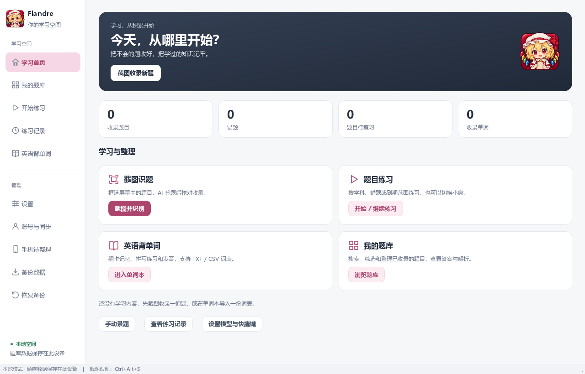

# Flandre Notebook · AI 错题本

最新发布：Windows **0.4.0-preview.20** / Android **0.2.0-preview.10**（2026-10-11）。修复备份覆盖、模型跳转、JSON/CSV 互通和桌宠打开流程，批量识题共享原图；电脑包含托盘与内置 DeepSeek 服务。首次使用为空题库，已有题库保留。

下载：[Windows 免安装 ZIP](https://github.com/flandre0605/flandre-notebook/releases/tag/v0.4.0-preview.20) · [Android APK](https://github.com/flandre0605/flandre-notebook/releases/tag/android-v0.2.0-preview.10)。每个发布页附中文使用说明和 SHA-256 校验文件。真实收信、新账号双端登录和手机云端闭环仍需实机验收；配置见 [账号注册配置](账号注册配置.md)。

手机现已增加 DeepSeek 网页版本机接入，支持官方网页手动登录或填写自己的网页 Token；识题和单词补全不依赖电脑或额外反代服务，凭据加密并独立于账号同步。真实网页登录与图片识别尚待验收，操作见 [安卓说明](android/README.md)。

以本地学习为基础的错题本，电脑与手机共用浅灰背景、白色内容卡片、深色学习首页与玫瑰色操作。收集题目、安排练习，也可以学习英语单词。

面向纸质刷题：手机和电脑各自支持整理错题与学习，账号用于共享私有题库。电脑正式题目及图片同步已获用户确认；CloudBase 上海 004、005 已部署，手机正式云端写回、待整理双账号权限与实机流程仍需验收。预算仍待确定。

Android 可独立使用：本机题库、手机识题/核对、公式、练习/复习、单词、JSON/CSV、打印与备份均已接入，登录用于云端同步。单词和详细作答历史暂存手机本地；手机和电脑分别下载对应发布包，最新范围见 [安卓说明](android/README.md)。



## 当前预览版功能

- 功能首页：截图识题、题目练习、英语背单词、题库入口和真实学习统计。
- 题库管理：新增、编辑、删除、搜索、按学科/题型/状态筛选，查看答案解析和图片附件。
- 选择题选项：手动录题、识题草稿、文件交换共用选项结构；练习提供单选/多选控件，支持选项公式。
- 题库文件：JSON/CSV 核对后导入、重复跳过、按筛选导出，以及带公式的 PDF 打印文件。
- 分类与统计：年级、标签、知识点、来源和难度；累计作答统计、近 90 天学习热力图、学科正确率与常见错因。
- 图片识题：自定义截图快捷键、粘贴/拖入/选择图片；AI 自动分题，核对草稿后收录。
- 文字响应恢复：单题回复有明确题目、解答及答案/结论时，可在本机整理为草稿；支持粘贴已有文字，原始响应随未确认草稿保存，恢复不重发识题请求。含多题或不完整的普通文字仍需人工处理。
- 手机待整理：独立私有收件箱，原图和裁剪图校验后接收；断网可继续已保存草稿，核对收录后才加入题库，两张图一起保存并进入正式同步。收录与回执队列同事务，重新识题的草稿分支共享重复收录保护。
- 模型配置：多个 OpenAI 兼容服务、自定义地址及路径、连接验证、模型列表选择。
- 默认模型：识题与单词补全分别设置，重启保留；任务内可手动切换，识题草稿恢复原配置。
- 数学公式：常见 LaTeX 离线预览，草稿可切换源码编辑；不支持的公式保留原文。
- 个人笔记：题库详情可直接修改，停止输入后自动保存，支持手动保存、撤销未保存修改和公式预览；练习提交后可展开，随文件和备份保存。
- 练习与复习：按学科和全部/错题/到期范围练习、规则判分或自评、作答历史、小窗模式；提交后可调整错题标记，记录时一起保存。
- 桌宠式小窗：透明背景的 Q 版全身芙兰，拖动小人或答题卡标题移动；点击角色或“收起”只留下角色，再点角色展开。右下角可调整答题卡大小，右键角色、“返回”或 Esc 回到完整界面，作答状态保留。
- 桌宠表情：待机、开心、思考、委屈、困倦、惊讶共六种；根据悬停、输入、作答结果和拖动自动切换。收起后无互动 45 秒变困，鼠标移入或展开会唤醒。
- 系统托盘：关闭主窗口后后台运行，双击恢复；右键显示桌宠时自动选择小窗模式，开始练习后直接打开。升级前先从托盘退出旧程序。
- 桌宠走路：使用用户提供的完整八帧人物素材，没有肢体拼接；拖到半空先落地，悬停或操作时暂停，保留转向和位置复原。
- 内置 DeepSeek 网页版服务及运行环境：无需另外安装 Python/Git，启用后添加自己的网页账号；账号与个人数据库不进入程序包。
- 复习设置：在“设置 → 复习设置”调整三种掌握程度的间隔（0～365 天），保存后用于后续记录。
- 进度恢复：录题/识题/单词草稿和题目练习、翻卡/拼写可在重启后继续；恢复草稿不自动调用模型。
- 单词本：TXT/CSV 导入、AI 补全释义/音标/例句、翻卡与拼写、系统英语发音及语速调节。
- 数据备份：题库、单词进度和图片附件的 ZIP 备份与恢复，恢复前自动备份；备份写入失败保留原文件，同批识题共享原图。
- 账号与同步：当前窗口切换账号，数据目录独立，导入前备份；同步正式题目、笔记、掌握状态和原图，持久离线队列、重试、删除及冲突选择。用户已确认正式题目/图片同步成功；手机待整理的 005 已在当前上海环境部署，普通账号权限及实机闭环仍需验证。

## 在 Windows 上运行

下载 Windows `0.4.0-preview.20` 免安装 ZIP（约 104.2 MiB），完整解压后运行 `FlandreNotebook/FlandreNotebook.exe`，无需 Python。安卓下载 `0.2.0-preview.10` APK（约 2.1 MiB）覆盖安装；同签名保留已有题库，无需卸载。旧发布页保留历史版本，升级步骤见 [Windows 构建与交付](Windows构建与交付.md) 和 [安卓说明](android/README.md)。

Windows 新免安装包包含个人笔记直接编辑、桌宠表情、热力图、识题文字恢复、账号同步和手机待整理，并已用实际 EXE 通过独立临时目录运行检查。完整状态见 [功能完成与验收](功能完成与验收.md)。

从源码运行时，准备 Python 3.10 或更高版本。在项目目录执行：

```powershell
python -m venv .venv
.venv/Scripts/python.exe -m pip install -r requirements.txt
.venv/Scripts/python.exe main.py
```

首次运行可直接手动录题和练习。图片识别需在设置中添加支持图片输入的 OpenAI 兼容模型；单词自动补全需要可用文本模型。英语发音使用系统安装的英语语音。

侧栏“账号与同步”可在当前窗口登录、注册和切换账号题库，也可运行 `.venv/Scripts/python.exe main.py --cloud`。当前上海环境已部署云端业务脚本，使用此环境无需重复配置。登录后可选择导入本机题库或立即同步；登录本身不自动上传。密码不保存，续期凭据由 Windows 凭据管理器保护。启动恢复上次账号，联网同步自动续期；侧栏“本机题库”可回到访客内容，主动退出在原窗口返回本机并清除登录。旧版升级后先重新登录一次。同步目前为手动触发，账号内整库 ZIP 恢复仍待完善。

识题和模型答案需人工核对；精确数字答案可比较分数、小数、百分数和简单 LaTeX 分数，通用数学等价式或主观答案仍使用自评。

关闭后可从首页“继续识题草稿”恢复图片及多题核对，窗口底部可选择不同任务或舍弃草稿。原图副本在发送请求前保存到本机，未完成的请求不会自动重发。已产生草稿时重新识别会新建任务，之前核对的文字与个人笔记保留在旧任务。单词本的“继续导入草稿”恢复已补全词表；“开始 / 继续背诵”恢复当前队列和拼写输入，“结束本轮”保留已记录复习次数。未确认的草稿和进度进入 ZIP 备份，不会自动收录为正式内容。

题库文件入口位于“我的题库 → 导入 / 导出”，CSV 模板见 [题库模板](assets/question_template.csv)。题目文字文件不包含图片或历史，完整迁移请使用 ZIP 备份。“练习记录”可切换学习统计和最近 500 条作答。本地开发版的新功能记录见 [更新记录](CHANGELOG.md)，已有 GitHub 发布包不会自动包含后续源码改动。

新增/编辑题目和识题草稿中的“选择题选项”可逐项填写；题型填写“单选题”或“多选题”，标准答案使用 A 或 AC 等标号。没有结构化选项的旧题继续手动输入答案，升级保留原题干，补充选项时可自行移除题干中的重复选项。复习默认间隔为已掌握 7 天、还不熟 1 天、不会 0 天；调整不会重排已存在的到期时间，单词复习规则独立。

## 数据与凭据

Windows 默认将本地题库、图片、单词和草稿保存在 `%LOCALAPPDATA%\FlandreNotebook\data`；账号分别保存在相邻 `data-accounts/<环境与用户编号摘要>` 目录。可在“设置 → 数据存储”查看并打开当前目录。更换源码目录后仍使用同一份学习数据；API Key 保存在系统凭据管理器，题库备份不包含密钥。当前数据库版本 v12，升级前自动保存数据库快照，仍建议在旧版导出含原图的 ZIP；旧程序不能打开已升级的数据库。

升级时先关闭旧程序。新目录尚无题库时，首次启动会从当前项目的旧 `data/` 复制数据库、附件和学习备份；完成校验后启用新目录，旧文件保留。若新目录已有题库则直接使用，不自动合并两份题库。损坏、缺图或版本不兼容会停止迁移并显示错误。要从其他位置迁入数据，可在旧版导出 ZIP，再通过“恢复备份”导入。

开发或便携运行可在启动前设置 `FLANDRE_DATA_DIR` 为绝对路径，指定一套独立数据；运行中通过应用的账号入口切换学习空间。Linux 使用 `$XDG_DATA_HOME/FlandreNotebook/data`（未设置时为 `~/.local/share/FlandreNotebook/data`）。

可选的 DeepSeek 网页版本地服务使用独立目录和环境，普通功能无需安装。它采用非官方接口，存在账号限制风险；不会在启动错题本时自动安装或调用网页账号。具体配置与限制见 [接入说明](DeepSeek网页版接入.md)。

“设置 → 默认模型”只提供已启用的配置，截图识题还要求勾选视觉能力。默认配置被禁用、删除或取消视觉能力时自动选可用配置；不会发起连接测试或识题。偏好保存在当前设备，不随题库 ZIP 迁移；进行中的单词任务保留手动选择。

## 文档

独立验证工具继续保留：用户已验证 CloudBase 真实登录、测试表读写及两个普通账号的双向访问隔离。运行 `.venv/Scripts/python.exe tools/cloud_login_check.py --database` 可打开数据验证窗口，已部署环境无需重复建表。正式程序的账号与手动同步另见同步方案 8.8，不能用独立探针结果推定正式服务验收通过。

私有图片验证使用 `.venv/Scripts/python.exe tools/cloud_login_check.py --storage`。模拟检查及 `tes_1` / `tes_2` 的真实小型 PNG 上传、下载、覆盖、临时链接生成、删除和双向访问隔离已通过，本轮图片已确认清理；证据限于专用测试桶，正式附件的云端往返仍待验收，详见同步方案 8.7。

- [手机端与账号同步方案](手机端与账号同步方案.md)
- [更新记录](CHANGELOG.md)
- [Windows 构建与交付](Windows构建与交付.md)
- [开发手册](开发手册.md)
- [业务需求与架构](错题本开发文档.md)
- [功能完成与验收](功能完成与验收.md)
- [项目说明](错题本项目说明.md)

本仓库不包含个人题库、API Key、网页登录 Token 或本地反代源码与环境。可选反代是独立第三方项目，遵循其自己的许可证。
