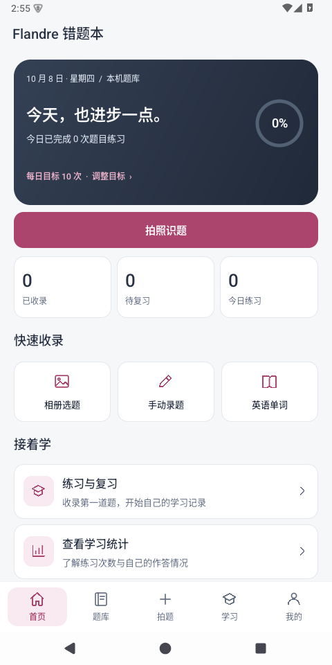
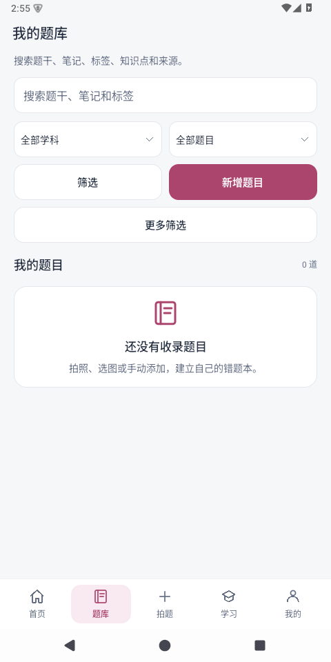
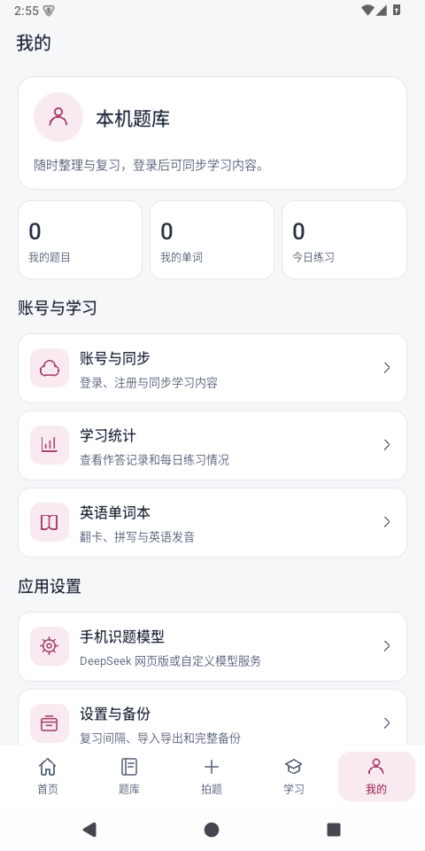
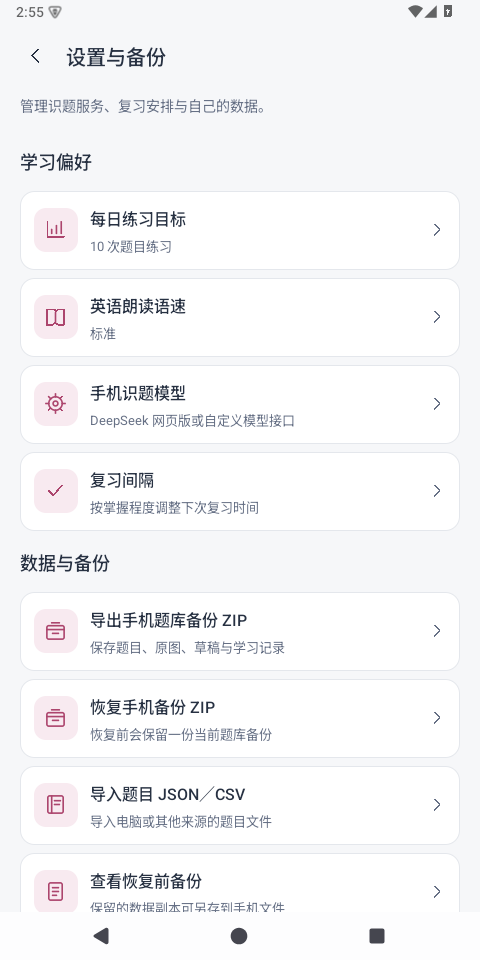
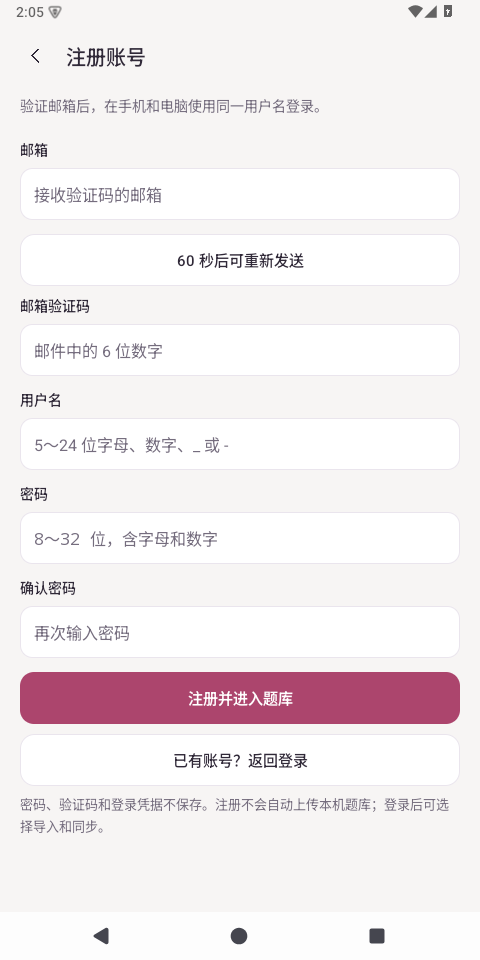

# Flandre Android 独立错题本

当前开发预览版：**0.2.0-preview.9**。Android 8.0（API 26）及以上，编译目标 Android 15。手机能独立录题、识题、整理、练习和复习；电脑是共享同一账号题库的另一客户端。

本版 APK 已发布到 [Android GitHub Release](https://github.com/flandre0605/flandre-notebook/releases/tag/android-v0.2.0-preview.9)，附中文说明和校验文件。本地构建产物为 `dist/Flandre-Android-0.2.0-preview.9.apk`。电脑同时发布 [Windows 0.4.0-preview.5](https://github.com/flandre0605/flandre-notebook/releases/tag/v0.4.0-preview.5)；两端共用邮箱注册和登录保持，账号数据独立保存。旧发布页仅保留历史版本。

## 界面

底部固定五个入口：首页、题库、拍题、学习、我的。浅灰背景、白色内容卡片、深色学习卡片与玫瑰色主操作形成层次。首页显示本机真实题目/复习/练习数量、每日目标进度；主要操作使用粉色按钮，次要入口采用卡片。题库的 JSON/CSV 导出和打印位于右上角菜单。模型、账号与备份入口集中在“我的”；编辑与设置页保留返回栏，输入时底部导航隐藏。

使用原生 Android 控件和本地绘制图标，按钮/导航/返回触摸区域至少 48 dp，页面可滚动、长文本换行。隔离模拟器在 480×960 常规字体和 320×720、1.3 倍字体下均通过 196 项检查；新增导航、忙碌保护、键盘避让、草稿返回保存、导出/打印菜单检查，以及流数据截断复现与单词核对保存检查。新增组合筛选、随机练习固定范围、自评与错题标记独立保存、单词分页/筛选范围、长短公式自适应高度检查。

下图为首次使用的空题库界面，统计来自本机，不生成演示数据：





题库卡片已改为独立标签和离线公式预览；宽公式按实际内容宽度缩放，长题干只预览，点击进入详情。每页最多 12 题，换页或离开时释放公式视图；练习、导出、打印仍使用完整筛选范围。





## 在电脑直接预览安卓端

双击项目根目录的 **预览安卓端.cmd**。它会构建当前源码、打开专用的 `flandre-preview` 安卓模拟器并安装启动 App。后续保存安卓源码、界面资源或版本信息后，会自动重新构建并覆盖到模拟器中，题库与草稿保留；关闭模拟器或预览终端即可停止自动更新。

预览运行实际安卓 App，使用独立的模拟器空间，不复制手机/电脑题库或登录凭据，也不安装到连接的实体手机。需要测试真实同步或模型时，在预览中自行登录普通账号。电脑可以键盘输入和操作页面；手机相机、系统兼容性和真实网络仍需手机验收。

这不是热替换原生代码：每次更新会自动构建和重启模拟器里的 App，通常十几秒，编辑中的内容应先保存。实体手机获取新功能仍需要覆盖安装新版 APK，保留相同签名即可，无需卸载。

当前工作区已有 SDK/JDK。其他电脑需先配置 Android SDK 35 的 platform/build-tools/emulator/default x86_64 镜像和 JDK 17；也可指定路径：

```powershell
python scripts/preview_android.py --sdk <SDK目录> --java-home <JDK目录> --watch
```

## 单词补全结果

单词结果先校验完整 JSON 和字段，再显示单词、中文释义、音标、例句四项可编辑表单，确认后批量保存。输入、生成结果和核对修改保存在所属手机空间，返回/重开可继续；只有保存成功才清除待核对结果。响应不完整时显示失败说明和原始响应入口，不提供成功保存按钮。

已修复原流解析中丢弃负数片段索引与相对 BATCH 路径的问题；支持最后一段内容增量、普通正文路径和批量终态，同时继续排除思考/状态元数据。已有双重流解析复现检查可验证不会只留下 `{"`。兼容依据包含[第三方原始 SSE 样本观察](https://github.com/rockswang/deepseek-v4-pro/blob/main/docs/DeepSeekSSE%E8%A1%8C%E4%B8%BA%E7%BB%93%E6%9E%84%E8%AF%B4%E6%98%8E-2026-04-05.md)，这不是官方稳定协议；真实账号仍需再次验证。

## 开始使用

1. 安装新版 APK。同一开发签名可覆盖旧版，旧账号照片队列保留；不要先卸载，卸载会清除手机私有数据。
2. 首次打开进入“本机题库”，不要求云端登录。可以手动录题，或拍照/选图，在图片上框选后选择“在手机识题并整理”。
3. 照片先保存为草稿，原图和裁剪图都保留。可手动整理、粘贴已有 JSON／明确的完整单题文字，或配置手机模型后点击 AI 识题。核对草稿、公式和选项后，再确认收录。
4. 在题库编辑、搜索、筛选和练习；作答后自评正确与否，再选择掌握程度安排下一次复习。练习和单词翻卡／拼写进度在重启后可以继续。
5. 需要跨设备互通时，在“账号与同步”登录和电脑相同的普通账号，再手动同步。账号与本机空间各自保存；可选择导入本机空间的题目，导入前备份，重复导入跳过，原本机数据保留。
6. 当前项目上海环境已部署 004、005，无需重复执行。手机独立题库只使用已有 004 正式题目协议；“发送给电脑整理”仍为可选入口。

## 登录保持

登录状态由系统安全保存，重启应用后恢复同一账号；访问凭据将到期时自动续期。断网不会清除账号，本地题库和待同步修改保留。主动退出或云端撤销登录后需重新登录。旧版本没有保存续期凭据，升级本版后先重新登录一次。

已用模拟续期响应检查轮换保存、401 重试、403 不重试、断网保留、账号绑定与撤销；另经过真实进程关闭/冷启动恢复（合成凭据）检查。真实账号到期及手机进程回收仍需真机验收。

## 账号注册

入口：我的 → 账号与同步 → 登录账号 → 没有账号？注册新账号。填写邮箱并发送验证码，输入邮件中的 6 位数字、用户名及两次密码。用户名 5～24 位字母/数字/下划线/短横线，密码 8～32 位且包含字母和数字。

注册依次调用官方发送、验证和注册接口，成功后直接进入该账号独立题库。手机和电脑使用同一用户名登录；原本机题库保留，可选择导入，注册不自动上传学习数据。验证码及验证令牌仅在当前页面/请求内存中使用，密码不保存。续期凭据由 Android Keystore 加密保存，访问凭据只在内存使用。

每次发送后等待至少 60 秒；修改邮箱后必须重新获取验证码。错误验证码、过期、已注册邮箱、重复用户名、云端限流和不完整响应均不会被视为成功。注册响应丢失时请先尝试登录，不自动重试创建账号。额外人机验证码当前会停止并提示，尚无 CAPTCHA 交互页面；找回密码尚未实现。

上海环境已在 2026-10-07 配置内置代发邮件并启用邮箱验证码，控制台提示最多 5 分钟生效。无需新增数据库表或在客户端存放管理密钥。配置及排查见 [账号注册配置](../账号注册配置.md)。真实邮件送达及新用户双端登录仍需使用用户自己的邮箱验收。



## 手机模型与离线使用

“我的 → 手机识题模型”可以选择 **DeepSeek 网页版（手机本机）**，或填写自定义 OpenAI 兼容服务的完整 HTTPS 地址、模型名称及 API Key。

### DeepSeek 网页版在手机本机使用

1. 点击“DeepSeek 网页版（手机本机）→ 在手机登录 DeepSeek”，在官方网页完成自己的账号登录，再点击“我已登录，使用此账号”。网页密码不由应用保存，退出网页后清理 WebView 登录数据；重启也清理遗留的网页登录数据。
2. 内嵌页只允许 DeepSeek 域内页面跳转，暂不支持第三方 OAuth 登录跳转。若内嵌网页登录不可用，可填写自己的网页登录 Token，点击“保存并启用网页版”。这是网页账号凭据，不是 DeepSeek API Key；不要分享到聊天、题库或 GitHub。
3. 返回图片草稿点击手机 AI 识题，或在单词本点击 AI 补全。校验计算、图片上传、独立会话和响应解析均在手机完成，不需要电脑在线，不部署反代服务器、不运行 Python，也不开放本机 HTTP 端口。
4. Token 通过现有 Android Keystore 按空间加密保存，不进入 ZIP 或云端同步；手机和电脑的网页登录设置分别管理。可在此页重新登录或清除登录。只使用自己的账号，不共享令牌或轮换账号。
5. 每次任务创建新会话，避免两张试卷或识题/单词任务混用。未完成、空响应和错误不视为成功；保留照片草稿，不自动重试。网页上产生的会话不自动删除。

这是对桌面 DeeperSeeker 固定版本协议的原生移植，非官方接口可能变化、限流或失效。需要支持 WebAssembly/BigInt 的现代 Android System WebView；计算在本地 Web Worker，难度上限 1000000、60 秒超时，旧 WebView 或格式变化时停止。APK 包含 MIT 的本机 WASM 模块与许可证，不包含网页账号、第三方 Python 环境或管理后台。

### 自定义模型接口

自定义地址必须是手机可访问的 HTTPS 服务；电脑本机的 `localhost` 网页服务地址仍不能直接作为手机模型地址。选择“保存并使用自定义接口”即可切换，已有加密网页登录会保留，需清除时在网页版页操作。

手机直接请求所填服务，不要求电脑在线，不存放管理员密钥。API Key 和网页登录 Token 使用 Android Keystore 加密，按空间分别保存，不进入题库云同步或 ZIP。请求仅在手动点击时发出，失败不自动重试；模型原始文字与照片保存在草稿中，可在本机恢复。

不登录也能使用本机题库。登录状态由系统加密保存，重启后恢复上次账号，联网同步时自动续期；断网保留本地题库。主动退出会清除登录状态并返回本机空间，云端撤销登录则提示重新登录。旧版未保存续期凭据，升级后需先重新登录一次。密码不保存，登录凭据不进入备份或云端题库。手机系统解锁保护本机学习数据，当前未提供应用内 PIN 锁。

## 功能与互通范围

| 功能 | 手机当前行为 |
| --- | --- |
| 题目管理 | 新增、编辑、删除、学科/题型/难度/错题/到期/掌握状态筛选；最近收录、优先到期、最近练习排序；搜索题干、来源、标签、知识点和笔记 |
| 图片与识题 | 系统拍照/选图、框选、保留原图和裁剪图；独立模型识题、文字恢复、可恢复多题草稿；核对后收录 |
| 数学公式 | 随 APK 打包 KaTeX，断网排版；题目/答案/解析分区展示，正文高度自适应（超 4096 dp 可在正文内继续滚动）；不支持的语法保留原文。正文先转义，禁止远程资源和网页桥接 |
| 学习 | 顺序或随机出题，单选/多选、自评和独立错题标记；自评与作答进度保存；三种掌握状态、0～365 天复习间隔、到期复习与作答历史 |
| 单词 | 搜索、到期/掌握状态筛选、每页 40 条；按筛选范围翻卡/拼写，翻开后记录掌握；手动编辑、TXT、AI 补全与可调语速的系统英语语音 |
| 学习统计 | 真实累计/今日作答与正确率、近 7 天图表、最近 90 个学习日；每日 1～500 次练习目标按手机空间保存 |
| 文件交换 | 题目 JSON/CSV 导入与筛选导出；中文 CSV 标题或电脑的字段标题；重复题目跳过，错误批次整体回滚 |
| 打印 | 系统打印和保存 PDF，包含题干、选项和公式；每次最多 200 题／50 万字 |
| 备份 | 手机 ZIP 包含题库、原图、草稿、同步队列、单词与作答记录；恢复前创建并可另存恢复前备份 |
| 题目互通 | 与电脑共用正式题目、原图、笔记、掌握状态及删除；手机离线修改保留，回执丢失重试原操作编号 |
| 冲突 | 提示选择本机或云端，保留本机草稿副本；远端删除后选择保留手机内容会另存新题，不复活旧编号 |

单词本和详细作答历史目前在手机本地保存，未与电脑同步。草稿和模型设置也不跨设备共享；题目复习间隔设置为本机设置。照片发送给电脑的旧队列保留，但不包含在独立题库 ZIP 中；其中需要保留的照片应先整理收录。手机 ZIP 与电脑 SQLite ZIP 不互相直接恢复，题目可通过账号同步或 JSON/CSV 交换。

图片支持 PNG/JPEG/WEBP，单张上限 20 MB。裁剪基于最长边不超过 2048 像素的预览，原始文件保持完整；查看原图使用内存受限的预览。单题同步最多 50 张图片、1 MB 文本；每轮最多发送 200 项、接收 1000 项，剩余内容下一轮同步。JSON/CSV 文件上限 8 MB；手机备份总量上限 256 MB，元数据 16 MB、每表 20000 条。图片暂不自动回收；同一照片同时由不同电脑核对时仍没有跨设备编辑锁。

## 构建与检查

使用 JDK 17，以及官方 Android SDK 的 `platforms;android-35`、`build-tools;35.0.0`：

```powershell
python scripts/build_android.py --sdk <SDK目录> --java-home <JDK目录> --checks
```

使用 AAPT2、javac、D8、zipalign 和 apksigner 构建，无 Gradle 或额外移动框架。开发签名仅保存在忽略的 `build/`，用于覆盖升级；生产发行需要独立签名与发布配置。APK 不包含测试工具、个人题库或签名密钥。

`--checks` 额外生成 `build/android-preview/checks/checks.apk`，在独立模拟器安装两个 APK 后运行：

```powershell
adb -s <测试设备> shell am instrument -w com.flandre.notebook.checks/com.flandre.notebook.NativeChecks
```

本次在隔离的 Android 15 模拟器通过 196 项原生检查，涵盖实际编辑/练习界面、冷启动继续学习、单词顺序、离线公式与转义、图片草稿、本机空间导入、CSV/识题响应校验、备份恢复、模拟同步重试/冲突/账号隔离，以及 DeepSeek 本机 WASM 的公开参考值/连续任务、模拟图片上传/新会话、SSE/中断/限流登录错误及加密网页登录设置。检查使用生成图片、独立临时空间和模拟接口，不使用个人凭据，不调用真实模型或实际云端。实际手机相机/选择器、真实 DeepSeek 网页账号登录/Token 与图片识别、自定义视觉模型、正式题库普通账号双向写回/权限、系统英语发音及 PDF 文件导出仍需真机验收。编译目标为 Android 15，Android 8.0 尚未实机测试。

## 第三方资源

离线公式使用 [KaTeX 0.16.22](https://github.com/KaTeX/KaTeX/tree/v0.16.22)，MIT 许可证；官方 npm 包的 SHA-512 完整性已核验。许可证和来源摘要随 APK 放在 `assets/math/LICENSE.txt`、`UPSTREAM.txt`。页面资源与字体全部本地读取，未使用 CDN。其他运行功能使用 Android 系统 API；导航图标由应用本地绘制，应用图标沿用项目现有资源。

DeepSeek 网页协议参考 [DeeperSeeker](https://github.com/AmanCode22/deeperseeker) 固定提交 `7e550f552b5b31429dcf5213394ca3e74154708f`；本机模块来自同提交的 [deepseek_pow_solver](https://github.com/AmanCode22/deepseek_pow_solver)，与固定 Git blob 完整性比对通过。`assets/deepseek/LICENSE.txt`、`UPSTREAM.txt` 包含许可、来源和 WASM SHA-256。
