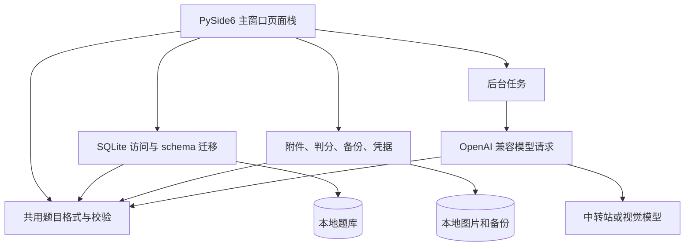

# AI 错题本开发手册

版本：0.2.0-preview.1（本地交付版，2026-10-03 更新）

适用阶段：现有功能维护与分阶段完善

依据：《错题本开发文档.md》《AI辅助开发指南.md》

## 1. 手册用途

本文把项目需求转换成可执行的开发步骤与协作约定。第 2 节及明确标注“当前”的内容来自现有源码核对；后续架构和开发顺序是目标建议，不代表相应功能已经实现。产品需求发生变化时，以用户最新确认的要求为准，并同步更新相关文档。

## 2. 当前项目状态

### 2026-10-03：按低到高补齐功能（本地开发版）

- **显示与阅读**：题库列表复用离线公式排版，最多缓存 64 个行预览；“展开阅读”在主窗口内查看完整题干、答案和解析。新增、编辑、删除后在状态栏反馈。
- **题库文件**：题库列表上方“导入 / 导出”进入文件页。JSON/CSV 每次最多 5 MB / 5000 道；支持 UTF-8/BOM 与 GB18030，CSV 接受中英文表头。文件先完整校验，再显示可编辑表格，确认后用一个事务导入；所有题目字段完全相同的题目跳过，不更新已有记录。模板为 `assets/question_template.csv`。JSON/CSV 可选择全部题目或进入文件页时的题库筛选结果，导出失败保留原目标文件。CSV 对可能被表格软件执行的文本加前导单引号，保留 `_flandre_escaped` 标记用于无损重新导入。PDF 使用 Qt 原生打印支持，离线排版常见公式，可选择是否包含答案与解析；PDF 用于打印，不支持重新导入。题目文件不含原图、练习进度或模型配置，完整迁移仍使用 ZIP 备份。
- **学习统计**：“练习记录”新增统计标签，查询全部题目作答，不受最近 500 条列表限制。展示累计记录、正确率、学习天数、用时、各学科表现、近七个本地日期及常见错因。正确率分母为正确 + 错误，排除跳过；自评结果计入。优先复习提示只比较至少 3 次已判定作答且有错误的学科，是简单排序提示，不是知识诊断；单词复习暂不纳入。
- **分类字段**：编辑页“分类与来源”支持标签、知识点、来源和简单/中等/困难；未设置可留空。搜索覆盖题干、学科、标签、知识点和来源，另有难度筛选；勾选沿用题库筛选时难度也作用于练习。字段随题目文件与完整备份保存；不要求模型自动填入，识题后可手动补充。年级、标签独立选择器仍待开发。
- **选择题选项**：题目统一使用 `options` 对象，标号 A～Z 对应完整文字，正式题目为 2～12 项或空对象。手动录题、识题核对和文件导入共用 `OptionsEditor`；选项支持公式预览，删除选项不重排标号。选择题答案填写标号（A、AC），多选按标号集合精确比较；未知标号、重复标号或无法解释的标准答案转自评。单选也接受唯一匹配的完整选项文字。旧题升级后选项为空，保留原题干和手输作答，不自动猜测拆分。题库详情、完整阅读和 PDF 组合展示题干与选项。练习选项支持小窗和重启恢复；题目选项变化后需重新提交。
- **复习设置**：设置页新增“复习设置”，三种掌握程度分别设 0～365 天，默认 7/1/0；0 表示立即到期。规则存入 SQLite `review_preferences` 并纳入 ZIP 备份，修改只用于之后记录的作答，不重排原到期时间。练习页面显示实际间隔，单词复习仍使用独立规则。
- **数字判分**：标准答案与作答为纯数字时，使用标准库 `Fraction` 精确比较整数、小数、分数、百分数及有界科学计数法；简单 LaTeX 分数也适用。`1/2`、`0.5`、`50%` 可判为等值。不会执行输入表达式，不做容差猜测；复杂公式、同义表达和主观题仍使用原规则或自评。
- **草稿与练习恢复**：手动新增/编辑草稿和题目练习的队列、当前索引、答案、已揭示状态、掌握度、错因、累计记录及用时保存在 `workspace_state`。编辑后延迟 600 毫秒保存，正常关闭和备份前立即保存；意外终止可能丢失最近 600 毫秒输入，停机时间不计入答题用时。新增/编辑返回题库保留草稿，下次同一入口继续；保存正式题目与清除其草稿处于一个事务。“开始练习”恢复上轮；每轮可设 1～200 题，默认最多 20 题。“记录并继续”把作答、复习状态和下一题检查点放在同一事务，完成自动清除进度；“结束本轮”只放弃未记录作答，已记录历史保留。引用题目已删除或状态无效时需重新选题；当前题干、标准答案、题型或选项变化后保留答案并要求重新提交。识题任务、单词导入/编辑草稿和背词卡片也已支持恢复，详见 2.2。

数据库 schema 升至 v9：v7 增加题目分类字段，v8 增加工作区状态表，v9 增加选项及复习设置；旧题库和旧 ZIP 备份可逐级迁移。备份含上述草稿/题目练习进度及复习规则，仍不含 API Key 或网页登录 Token。恢复前校验选项和复习设置；恢复成功后销毁旧题目编辑、练习、附件及阅读页面，停止旧自动保存计时器，防止旧内容写入恢复后的数据库。v8 的旧练习检查点首次恢复需重新提交当前答案。

本轮未增加运行依赖。此前检查：`checks/check_question_tools.py`（文件往返、整批校验、重复跳过、PDF、统计及页面入口）、`checks/check_progress.py`（分类、数字判分、草稿/练习重启、记录回滚及恢复后旧页面清理）；均使用临时数据库，无真实 API 调用。公式、题库布局、单词/旧备份、小窗和按学科练习也曾通过检查。本次选项、复习设置及草稿恢复已通过临时数据检查，范围详见 2.2；真实兼容模型已通过自制两题图片识别检查，Windows 实际打印仍需用户验收。

稳定用户数据目录及迁移已通过临时数据检查；最终 Windows 安装版和免安装版完成 Windows 11 运行、安装/卸载及数据保留验收，详见 [Windows 构建与交付](Windows构建与交付.md)。主观题自动判分与复杂数学等价判定需要另外设计，不把参考模型输出直接作为确定评分。

### 2.1 结构化开发约定

| 模块 | 职责 | 复用边界 |
| --- | --- | --- |
| `app/question_data.py` | 题目字段、草稿/正式校验、选项解析、数据库值与阅读文字转换 | 纯标准库；UI、Provider、文件服务及 store 共用，不访问网络和数据库 |
| `app/ui/options_editor.py` | 添加、选择、编辑、移除选项及公式预览 | 手工表单、识题草稿、文件核对复用；不保存数据库 |
| `app/database/store.py` | SQL 查询、迁移、事务、进度与复习规则持久化 | 正式题目入口调用共用校验，作答与下一题状态原子写入 |
| `app/paths.py`、`app/services/storage.py` | 固定用户目录、旧数据文件复制、启动协调 | 路径与资源分离，数据库层不反向依赖服务层 |
| `app/services/grading.py` | 选项标号、数字、文本规则判分 | 不依赖 Qt，不调用模型，返回正确/错误/需自评 |
| `app/services/question_files.py` | JSON/CSV 读取、整批导入、导出与 PDF | 共用题目字段和校验；不会覆盖同名旧题或导入个人凭据 |
| `app/ui/review_settings.py` | 复习天数输入及页面反馈 | 设置界面委托 store 保存，练习从数据库读取规则 |
| `app/services/recognition_drafts.py` | 持久化识题任务、图片路径校验及任务清理 | 多任务独立保存；通过 store 写工作区状态，不请求模型 |
| `app/database/vocabulary.py` | 词条校验、保存、复习与导入事务 | 正式保存与草稿清除、复习与下一卡片状态同事务 |

开发一个功能时先追踪“输入 → 校验 → 草稿 → 确认 → 事务保存 → 展示/练习 → 文件交换”的实际路径，修改同一规则的所有入口。新增题目字段先在共用格式中定义，再追加有序迁移、更新相关表单/导出/备份及文档；不为未来需求添加空接口或多层仓库。

选项文件格式：JSON 的 `options` 为对象，例如 `{"A":"is","B":"are"}`；CSV 的 `options` 单元格保存同一对象的 JSON 文本，逗号和引号按 CSV 转义，参见模板。无选项使用 `{}`，旧文件省略该字段也可导入。文件核对页显示选项数量，选中题目后点“编辑选中题目的选项”编辑，不要求用户在界面手写 JSON。

### 2.2 草稿恢复与事务约定

- 工作区键：`question:new/id`、`practice`、`vocabulary:word:new/id`、`vocabulary:import`、`vocabulary:study`、`recognition:<随机编号>`。复用 schema v8 的 `workspace_state`，本次恢复功能无新增 schema。
- 识题任务：发送前复制原图至 `attachments/drafts/<编号>.<扩展名>`，再保存状态。每次新截图独立；图片替换后下一次识别创建新任务，旧任务保留。成功响应后保存草稿，编辑延迟 600 毫秒保存，关闭和备份前立即保存。首页可继续；恢复只读本地数据，不调用模型。识别过程中关闭窗口会丢弃迟到响应，保留原图，后续重试需用户点击。
- 识题收录：附件服务先校验整批草稿并复制正式附件；store 用一个事务创建全部题目及附件引用、清除任务状态。失败回滚数据库并清理副本，成功后清理草稿原图；不得把已成功收录但清理失败当作收录失败再导入。草稿图片路径必须与任务编号对应且留在附件目录内。
- 单词草稿：词表保留已补全字段和文件名，不依赖原词表文件；手动编辑允许保存尚未填写完整的词条。翻译按批保存结果，恢复不自动续发；换入新缺释义词表前确认替换当前草稿。确认导入/保存词条与清除对应草稿在一个事务。
- 单词背诵：保存队列、索引、模式、拼写输入、翻卡状态及记住数量；恢复后重算拼写结果，不自动朗读。当前词条内容变化则要求重新翻卡/检查，队列含已删除词条则提示结束本轮。记录复习与下一卡片状态同事务；完成清除进度，结束本轮保留累计复习次数。
- 备份与恢复：ZIP 包含所有工作区状态及草稿原图；恢复校验任务路径、图片及内容结构。恢复成功后关闭旧识题窗口，停止旧编辑/练习/背诵计时器，取消旧翻译结果应用，再从新数据库加载草稿。未确认内容不会自动进入正式题库/单词库。
- 验证：`checks/check_recovery.py` 使用临时数据库与模拟模型/语音，覆盖选项、复习规则、重启恢复、事务回滚、缺图备份拒绝及恢复后旧窗口不会写回；另已复查题库文件、进度、单词、识题、主题及小窗检查。离屏和 Windows 桌面截图已查看；实际打包版完成静音英语合成、语速与自定义热键回调检查，真实兼容模型完成简单两题识图。不同语音、跨应用实际按键、复杂图片仍需按使用环境验收。

2026-10-03：默认启动页改为“学习首页”，展示截图识题、题目练习、英语背单词和我的题库四个功能入口，以及真实题目/错题/到期题目/单词数量和复习提醒。手动录题、练习记录、设置提供快捷入口；原列表与详情保留在“我的题库”。首页复用现有业务流程和 Qt 组件，没有新增依赖；小窗口内容可滚动。检查：`.venv/Scripts/python.exe checks/check_home.py`。

已加入可选 DeepSeek 网页版本地服务入口：设置页可启动服务、打开管理页及复制随机管理密码，并复用现有 OpenAI 兼容配置和图片草稿流程。独立服务已安装并验证本地鉴权、模型列表与未配置账号提示；独立请求增加唯一任务编号，避免相同识题提示词忽略图片差异后复用网页会话；真实识图尚待用户在本机添加网页 Token 后验证。额外环境本机约 63.6 MiB，无浏览器内核；不纳入题库备份。安装与操作见 [DeepSeek网页版接入.md](DeepSeek网页版接入.md)。

识题输出预算为 6000 tokens。接口明确返回长度截断时拒绝收录并提示分批截图；解析不会从损坏的批量 JSON 中静默抽取部分题目。仅当格式错误的响应包含题干字段时，追加一次纯文本格式整理请求（会多调用一次所选模型），成功后仍需用户核对；失败在识题窗口内提供“查看原始响应”，可选择、复制，关闭窗口后不持久保存。共享请求层识别 HTTP 成功响应中的 error 对象及已知上游不可用通知，直接报错且不触发格式整理，连接测试和单词补全同样适用。未知非草稿文本也不触发整理。原始响应保留供查看；中转站自己的重试与计费不受客户端控制。公式提示词包含正确转义的 JSON 示例。检查：`.venv/Scripts/python.exe checks/check_recognition_json.py`，使用模拟响应，无真实 API 调用。

数学公式已支持离线预览：识题草稿和手动编辑的题干、答案、解析提供“预览 / 编辑”切换；题库详情、完整及小窗练习使用同一排版模块 `app/ui/math_text.py`。支持 `$...$`、`$$...$$`、`\(...\)`、`\[...\]` 中的常见 LaTeX 数学表达式。数据库仍保存原文，预览区右键可复制含公式的原文；不支持的命令、过长公式或公式内中文字保留源码并提示，不保证完整 LaTeX 支持。识题草稿内容可滚动，底部确认按钮固定，窗口按可用屏幕大小展开。

公式排版新增轻量依赖 `ziamath`，通过现有 Qt 将 SVG 转为内存图片；无需浏览器内核、TeX 安装或联网。更新环境运行 `python -m pip install -r requirements.txt`。实现依据：[Ziamath 官方文档](https://ziamath.readthedocs.io/en/latest/)。纯数字和简单 LaTeX 分数可精确比较数值；其他公式源码归一化后完全一致可判对，其余转自评，不进行通用数学等价式判定。

公式检查：`.venv/Scripts/python.exe checks/check_math_preview.py`，覆盖公式字形、四种分隔符、失败回退、HTML 转义、编辑原文保留、详情和练习显示、小窗及草稿底部操作可见；使用临时数据，不调用模型。可追加预览输出目录。

英语背单词已加入侧栏，词条与错题分开保存。支持单词/短语、中文释义、音标、例句和单词本名称的新增、编辑、删除；可搜索英文或释义，并按单词本、全部/新单词/到期复习筛选。背诵可选择“看英文记释义”或“看释义练拼写”，每轮 1～200 个；翻卡后按“没记住/还不熟/记住了”记录。拼写忽略大小写、首尾和重复空格，并统一全角字符及弯撇号；不会自动接受同义词，拼错只能按未记住记录。记住后的连续复习间隔为 1、3、7、14、30 天，后续封顶 30 天；还不熟重置连续次数并安排 1 天后复习，没记住立即到期。本轮队列不重复追加遗忘词，可返回单词本选择到期复习。记录成功才进入下一词，保存失败保留当前卡片；切换侧栏后再返回可继续本轮，程序退出后可继续未记录的卡片，结束本轮则清除队列并保留累计复习次数。累计复习次数、连续记住次数与下次时间保存在 SQLite，不保存逐次拼写日志。

单词导入支持 TXT 和 CSV，支持 UTF-8（含 BOM）和 GB18030，每次最多 5 MB/5000 条。TXT 每行一个英文单词或短语，可用 Tab 分隔中文释义；CSV 必须包含 `word`，可选 `meaning,phonetic,example,book`，也接受“单词,释义,音标,例句,单词本”表头。未指定单词本时使用文件名。释义齐全的文件完整校验后直接在一个事务中导入；缺少释义的文件先进入可编辑草稿页，可手填或自动翻译，点击“确认导入”才写入。重复单词按大小写不敏感匹配并跳过，保留已有内容与进度；缺释义的重复项优先复用本地词条。模板 `assets/vocabulary_template.csv` 包含 10 个可选示例词，`assets/vocabulary_template.txt` 提供对应纯英文词表，不会在启动时写入用户数据。业务位于 `app/database/vocabulary.py`，页面位于 `app/ui/vocabulary_page.py`。

发音使用现有 PySide6 的 `QTextToSpeech` 与系统安装的英语语音（Windows 优先使用 SAPI），支持语音选择、手动发音、停止和翻卡自动发音。页面底部“语速”提供较慢、稍慢、正常、稍快、较快五档，默认正常；通过 Qt QSettings 保存，重启后保留，对手动和自动朗读均生效。调节语速会停止当前朗读，下次发音使用新语速；更换语音也保留语速。系统语音的实际速度因引擎和声音而异，不将这些档位标为精确倍速。词条列表和编辑页也可试听；拼写模式在揭示答案后才允许朗读及展示音标，避免提前暴露答案。离开单词页或切换卡片会停止朗读。系统没有英语语音时显示安装提示，其余单词功能仍可使用。发音不调用 API，也不下载语音模型；辅助模块为 `app/ui/pronunciation.py`。

自动补全使用现有已启用的 OpenAI 兼容 Profile，文本模型即可，无需开启视觉能力；在编辑/导入页选择模型并点击补全。`app/prompts.py` 约束中文释义、IPA 音标和双语例句的 JSON 格式，`app/services/vocabulary_translation.py` 复用 HTTP、凭据和 JSON 解析，核验词条身份、字段类型、中文释义和完整性；仅服务明确拒绝 JSON 模式时退回提示词约束。后台 Worker 每批最多 20 个不同词条，页面显示进度；只补空白字段，用户填写内容保留。部分批次失败会保留已完成的草稿，重试只翻译缺释义词条。停止/离开草稿页后不再发送下一批，当前请求需等返回或所配置的超时；本批返回不会再应用。返回单词本后可点击“继续导入草稿”恢复核对；草稿自动保存在本地并纳入备份，恢复后点击继续导入核对；未经确认不进入正式单词库。手动管理、背诵和系统发音离线可用，自动补全需要网络和可用的模型配置，无新增依赖；尚无完整考试词库。

检查：`.venv/Scripts/python.exe checks/check_vocabulary.py` 覆盖迁移、词条、原子导入、背诵、拼写、间隔和新旧备份恢复；`.venv/Scripts/python.exe checks/check_vocabulary_enrichment.py` 覆盖 TXT/CSV、翻译输出校验、JSON 回退、批次失败/重试/停止、字段保留、拼写发音时机、语速保存与小尺寸布局。均使用临时数据库，翻译与朗读调用被替换，不访问真实模型或播放声音；追加预览目录可导出页面截图。实际听感仍需在桌面点击“发音”确认。

界面采用奶白和浅粉色主题，主要操作使用深玫瑰色，正文使用深梅色以保持可读性。统一样式位于 `app/ui/theme.py`，覆盖导航、按钮及禁用态、输入框、下拉框、数值框、快捷键编辑器、勾选框、标签页、列表和滚动条；题目列表分两行展示题干与学科/题型。题库、练习、识题、草稿、附件和模型设置共用主题。下拉箭头、勾选和图片占位图标位于 `assets/ui/`，为本地 SVG 素材，不增加第三方依赖。拖入图片时通过动态属性显示粉色高亮。主题检查：`.venv/Scripts/python.exe checks/check_theme.py`；可追加预览目录导出设置、识题和练习页面截图，使用临时数据库，不访问真实模型服务。

界面使用 Qt 原生短时动效：页面切换、题目详情/答案标签切换、识题草稿切换和练习内容更新采用 180 毫秒淡入；首页、侧栏、返回、识题及练习操作按钮采用 140 毫秒悬停过渡，并有按下反馈。同一窗口只运行一个内容淡入，快速切换会停止前一个效果，完成后移除透明度效果；空闲时不持续运行动画，不增加依赖。动效检查命令：`.venv/Scripts/python.exe checks/check_motion.py`。

题库页面采用“左侧导航 → 中间题目列表 → 右侧题目详情”的桌面工作区布局。顶部紧凑展示题库统计和新增/截图识题按钮；搜索、筛选位于列表上方；选中题目后，右侧可切换题目内容与答案解析，并执行编辑、附件、删除。列表与详情通过 Qt `QSplitter` 调整宽度，刷新列表会保留仍在结果中的选中题目。

当前已有 PySide6 程序入口和本地题库流程：手动新增、编辑、删除、搜索题目；按学科、题型、错题标记、未练习和掌握状态筛选。主窗口内容区通过页面切换承载题库、题目编辑、练习、历史、附件和设置；侧栏不再设置独立“AI 识题”板块。识题仅在截图或导入图片时作为临时窗口打开，输入和多题草稿在该窗口内切换；关闭后保留主窗口原页面。题目图片可拖放、粘贴或选择；截图快捷键可在“设置与模型服务”中自定义，默认 `Ctrl+Alt+S`，截取屏幕选区后弹出临时识别窗口并自动开始识别，题库顶部“截图识题”也可启动框选。截图不再单独占用侧栏入口。大图发送给模型前会临时缩小以控制内存，题库附件仍保留原图。单张图片可返回多道题目草稿，逐题核对或移除后统一收录，原图关联到每道题。图片支持 PNG/JPG/JPEG/WEBP，最大 20 MB。

练习页直接选择全部学科或某个学科，并组合全部题目、仅错题、到期复习范围，支持随机顺序；首次打开默认选中题库当前学科，后续保留练习页自己的学科选择。默认不带入题库其他筛选；勾选“沿用题库的搜索、题型和状态筛选”后才额外取交集。学科列表每次进入练习配置页都会刷新；没有符合条件的题目时在页面内提示并保留选择。提交后显示答案/解析；点击“记录并继续”会把用户答案、结果、用时、错因和掌握程度保存在本地历史中。单选、多选、判断和非主观题型使用规则判分（标准答案分隔符 `|` 表示可接受答案）；标记为解答、简答、主观、论述或证明等题型，以及缺少标准答案的题目，采用自评。规则判分使用文本、精确数字及有效选项标号比较，不是语义判分。复习间隔默认掌握 7 天、还不熟 1 天、不会立即到期，可在设置页调整；答错会自动标为错题。练习记录页展示最近 500 条记录及提交答案。

按学科练习检查：`.venv/Scripts/python.exe checks/check_practice_subjects.py`。该检查使用临时数据库，覆盖跨学科与全部/错题/到期组合、显式沿用筛选、随机顺序、新增学科刷新和空题库，不修改真实题库。

小窗练习：在练习配置页勾选“以小窗模式开始”，或练习过程中点击顶部“小窗练习”。默认大小约 480×640，支持拖动、调整大小及切换置顶；内容较多时滚动查看。小窗沿用浅粉色主题，并直接承载同一个 `PracticeDialog`，切换不重新生成题目或重置计时、用户答案、判定、错因及进度。点击“展开”、关闭小窗或按 Esc 返回完整界面；关闭小窗不会结束本轮练习。查看附件或打开截图识别窗口会先返回完整界面，保留练习进度。只点击“记录并继续”才写入练习历史；未记录输入自动保存，可在重启后继续题目练习。窗口承载与恢复逻辑位于 `app/ui/mini_practice_window.py`、`app/ui/main_window.py`，使用 Qt 原生窗口和滚动区域，不增加依赖。检查：`.venv/Scripts/python.exe checks/check_mini_practice.py`，使用临时数据库覆盖进度保留、置顶切换、关闭/展开/Esc 恢复、附件/识题切换、小尺寸滚动、练习完成及应用关闭；Windows 实际跨应用置顶效果仍需桌面验收。

“设置与模型服务”支持多个 OpenAI Chat Completions 兼容配置，可分别设置基础地址、请求路径、模型、API Key、超时和视觉能力；可通过 `GET /models` 获取模型列表，也可手动填写模型 ID，并自定义截图快捷键。快捷键由 Qt `QSettings` 持久化；Windows 注册全局热键失败时回退为应用内快捷键。远程地址要求 HTTPS。本地 API Key 存在系统凭据管理器中，不进入数据库备份。图片识题提示预设位于 `app/prompts.py`（尚未做提示词版本管理），优先请求 JSON 模式，不兼容时回退为提示词约束。

侧栏“备份数据”和“恢复备份”支持备份和恢复；恢复前验证数据库、附件路径和 ZIP 内容，并自动创建当前数据的恢复前备份。SQLite schema 当前为 v9，可从 v1 逐级迁移；v5 为练习历史增加用户答案列，v6 增加单词表，v7 增加题目分类字段，v8 增加工作区状态表，v9 增加选项和复习设置。新备份包含单词数据及题目复习规则；旧备份恢复后单词表为空，恢复前备份仍保留恢复前的数据。题库数据库及附件默认位于 Windows 用户目录 `%LOCALAPPDATA%\FlandreNotebook\data`；设置页可查看并打开，启动前可用绝对路径 `FLANDRE_DATA_DIR` 指定独立数据，不自动导入旧项目题库。旧项目 `data/` 首次复制迁移，保留旧文件；迁移细节见 8.1。知识点、标签、来源支持录入和文本搜索，难度支持筛选；尚未实现年级字段、厂商原生 Gemini/Grok 接口、AI 聊天、云同步。首页已通过临时数据库的离屏检查，覆盖选中与详情联动、筛选无结果、空题库及最小窗口布局；尚未完成完整用户验收。可运行 `.venv/Scripts/python.exe checks/check_library_layout.py` 重复该检查，检查不修改真实题库。

截图识别窗口检查：`.venv/Scripts/python.exe checks/check_recognition_popup.py`，使用临时数据与模拟模型，覆盖独立窗口、主页面保留、多题确认收录、原图关联、识别中关闭后的结果丢弃与清理、失败重试及应用关闭，不访问真实 API。

## 3. 产品范围与原则

- 面向单个学生的 Windows 桌面应用，默认本地保存题库、附件和答题记录。
- AI 识别、分类、答案和解析均先作为草稿展示；用户确认后才进入正式题目。
- 原始题干和原图不得被模型输出覆盖。识别失败不能丢失导入图片。
- 支持多个模型服务和 API 中转站配置。每项配置独立保存地址、模型、密钥引用、超时和能力信息，并可测试、选择和切换。
- 服务商的原生接口与 OpenAI 兼容接口分开适配；不能假设只替换基础 URL 就一定兼容。
- 本地录题、浏览和练习不依赖网络。网络请求和图片处理不能阻塞 Qt 主线程。
- 优先完成小而完整的用户流程；不要提前加入云同步、多用户或插件系统。

## 4. 环境准备

### 4.1 Windows 开发环境

需要 Python 和 pip。建议为项目使用独立虚拟环境。在 PowerShell 中：

```powershell
cd D:\project
python --version
python -m venv .venv
.\.venv\Scripts\Activate.ps1
python -m pip install --upgrade pip
python -m pip install -r requirements.txt
```

如 PowerShell 激活脚本受本机策略限制，可不激活环境，直接使用虚拟环境解释器：

```powershell
.\.venv\Scripts\python.exe -m pip install -r requirements.txt
```

PySide6 的 pip 安装包带有运行 Qt 应用所需的组件，一般不需要再单独安装 Qt SDK。SQLite 使用 Python 自带的 `sqlite3` 模块，不另装数据库服务。

### 4.2 依赖管理

- 每个项目依赖都必须有明确用途；优先标准库和已有依赖。
- 依赖选定后写入项目依赖清单（建议 `requirements.txt` 或 `pyproject.toml`），不要只依赖开发者机器上的全局安装。
- 当前模型 HTTP 请求使用 Python 标准库 `urllib.request`，密钥由 `keyring` 管理，图像显示/处理依赖 PySide6；不要为已有能力重复引入依赖。未来新增依赖时先确认必要性并写入依赖清单。
- 不在源码、示例配置、日志或 SQLite 中保存明文 API Key。

项目运行依赖可一次安装：`python -m pip install -r requirements.txt`。模型服务配置使用 Python `keyring` 接入 Windows 系统凭据存储；题库备份不会包含 API Key，换机器或恢复备份后需重新录入。

### 4.3 启动约定

应用入口建议为根目录的 `main.py`。入口创建 Qt 应用对象并打开主窗口；业务规则、SQL 和模型 HTTP 请求不写在入口文件中。入口文件创建后，可从项目根目录用以下命令启动：

```powershell
python main.py
```

## 5. 目录职责

### 5.1 当前实际目录

```text
app/
├─ database/       # SQLite 连接、schema 版本和迁移
├─ paths.py        # 应用资源与稳定用户目录、旧文件复制
├─ question_data.py # 共用题目字段、校验和选项格式
├─ prompts.py      # AI 识题 system/user 提示预设
├─ services/       # 模型请求、判分、文件交换、附件和备份
└─ ui/             # PySide6 窗口、页面和表单
assets/
├─ app_icon.svg    # 应用图标矢量源文件
└─ app_icon.ico    # Windows 窗口/任务栏图标
%LOCALAPPDATA%/FlandreNotebook/data/  # 独立于项目目录
├─ questions.db    # 首次运行后创建的本地 SQLite 数据库
└─ attachments/    # 正式原图及 drafts/ 中的未确认图片
```

当前没有独立的 `repositories/`、`domain/`、`providers/` 或迁移脚本目录；题库读写集中在 `app/database/store.py`，模型请求在 `app/services/model_provider.py`。

### 5.2 建议逐步增加的模块

```text
app/
├─ domain/         # 题目等领域对象和校验规则
├─ providers/      # OpenAI 兼容适配器及厂商原生适配器
├─ storage/        # 图片文件和备份文件操作
└─ prompts/        # 集中管理并标记版本的 AI 提示词
migrations/       # 按版本排序的 SQLite schema 迁移
```

只在对应功能开始时增加目录和模块。个人数据与源码分离；正式版的数据目录应使用应用数据目录配置，不应依赖源码当前工作路径。不要把个人题库、图片或密钥提交到版本库。

## 6. 模块边界和数据流

核心业务闭环是“收集题目 → 整理并确认 → 练习作答 → 记录结果 → 定期复习”。题库保存、搜索、手工录入和练习本地运行；模型服务只辅助识题和后续可选的反馈。

当前程序调用关系：



目标数据流（当前代码尚未完全按此分层）：

```text
PySide6 UI
  -> Application services
      -> Question validation（当前 app/question_data.py；复杂领域模型按需增加）
      -> Repositories（当前由 app/database/store.py 承担） -> SQLite
      -> Storage（当前分布在相关服务中） -> 图片/备份文件
      -> Model providers -> 外部模型 API
```

- **UI**：展示页面、收集用户输入和明确确认；当前部分 UI 直接调用 `store` 数据访问函数，后续可再抽应用服务层。
- **Application services**：编排录入、识别草稿确认、练习和备份等完整操作。
- **Domain**：表达题目、答案、掌握状态等核心数据和校验规则。
- **SQLite 数据访问**：当前由 `app/database/store.py` 封装查询与写入。
- **Storage**：负责附件复制、内部命名、预览路径与备份文件操作。
- **Providers**：封装模型服务请求、协议差异、错误映射和响应结构校验；不能直接修改正式题库。

耗时操作通过 Qt worker、线程池或合适的异步机制执行，并将加载、成功、失败和取消状态反馈到界面。不要在主线程等待网络响应或大型图片处理完成。

## 7. 推荐开发顺序

每个阶段完成一个可见的用户流程，再进入下一阶段。

已有功能包括手动题库、图片识题、OpenAI 兼容 Profile、练习复习和备份恢复；题库页筛选条件已可传入练习集。后续优先级按实际用户闭环安排，不需要为规划中的模块先搭空架子。

1. **应用骨架**：`main.py`、主窗口、中文界面基础布局、日志和配置目录。
2. **本地数据基础**：SQLite 连接、外键约束、schema 版本和第一份 migration。
3. **题目闭环**：题目领域对象、Repository、手动新增/编辑/删除、列表和题干搜索。
4. **图片附件与 AI 识题**：支持手工附件管理；单张识题图片可拆分为多道草稿，逐题核对后统一收录并关联原图。
5. **练习闭环**：练习集、隐藏答案、提交自评、揭示答案解析、记录用时和结果。
6. **复习基础**：错题标记、掌握状态、简单可解释的到期规则；规则集中配置。
7. **模型配置与识题**：已实现多个 OpenAI 兼容 Profile、系统凭据存储、模型列表、连接测试、自定义路径和可编辑识题草稿；原生服务商适配仍待实现。
8. **备份恢复**：已实现数据库和附件备份、恢复校验及恢复前备份。
9. **当前优先改进**：结构化选项、复习设置、草稿与进度恢复已完成检查；继续核对复杂图片效果及不同 Windows 环境的实际使用。
10. **交付现状**：稳定数据目录及旧数据迁移已验收，Windows 安装版/免安装版已生成并检查，本地版本尚未发布到 GitHub。只有确有需求时再增加原生 Gemini/Grok 适配和 AI 判题。

不要在第 3 阶段之前把 AI 识别当作录题的必要条件；手动录题必须始终可用。

### 7.1 当前功能的使用顺序

1. 运行 `python main.py`。
2. 打开“设置 → 模型服务”，为每个中转站分别填写 API 基础地址、请求路径和 API Key；常见填法是基础地址填写到 `/v1`，请求路径保持 `/chat/completions`。点击“获取模型列表”后可选模型；不开放模型列表的中转站仍可手动填写模型 ID。保存时会先校验字段，勾选视觉能力后测试连接，配置有改动时需重新测试。
3. 点击题库顶部“截图识题”或按自定义截图快捷键，框选后自动弹出识别窗口并开始识别；快捷键可在“设置与模型服务”中查看或更改，默认 Ctrl+Alt+S。也可直接把图片拖到主窗口打开识别窗口；窗口内仍支持文件选择、拖入和粘贴图片。选择视觉模型后逐题对照原图编辑草稿；可移除误拆的草稿，确认后分别收录并将原图关联到每道题。
4. 开始练习并提交答案。客观题显示系统判定；主观题选择自评结果。

识题提示预设集中在 `app/prompts.py`，要求模型按 `questions` 数组返回独立题目、转写完整条件并尝试作答；同一题号的小问保持在一个草稿中。请求优先启用 JSON 模式，若中转站明确不支持则自动退回提示词约束。结果仍作为草稿，需人工核对。

当前按 OpenAI Chat Completions 请求格式发送请求，并允许每个中转站自定义请求路径；“获取模型列表”使用兼容的 `GET /models` 接口。部分中转站不开放模型列表时，可手动填写模型 ID。图片识题还要求接口支持图片输入。远程地址要求 HTTPS，本地服务可用 HTTP。

## 8. 数据与迁移约定

### 8.1 用户数据目录与升级启动

- Windows 默认 `%LOCALAPPDATA%\FlandreNotebook\data`，设置页“数据存储”显示实际路径并可打开目录。源码资源仍来自项目 `assets/`，发布资源来自程序内部资源目录；学习数据不随源码覆盖。
- `FLANDRE_DATA_DIR` 支持绝对路径，启动前读取，用于独立开发数据或便携目录，指定时不自动导入旧项目数据；不提供运行中切换。Linux 默认 `$XDG_DATA_HOME/FlandreNotebook/data`，缺省基目录 `~/.local/share`。
- `main.py` 创建 Qt 应用后调用 `services/storage.initialize_storage()`：准备目录 → 必要时迁移旧学习文件 → 初始化数据库 → 展示主窗口。迁移成功在状态栏提示，失败显示原因并退出，不能静默改用空题库。
- `paths.prepare_data_directory()` 在新目录没有数据库时检查旧项目 `data/questions.db`（冻结程序检查可执行文件旁的 `data/`）。通过 SQLite 在线备份取得数据库副本；只复制 `attachments/`、`错题本备份.zip` 和 `pre-restore-*.zip`，不搬迁虚拟环境或网页版工具。
- 文件先写到新目录同一父目录的临时子目录，调用 `backup.validate_data_directory()` 完成完整性、schema、选项、复习设置、附件和识题草稿图片校验，写入 `migration.json`，再整体重命名启用。失败时由临时目录清理，旧目录保持不变；已有新题库直接使用，不自动合并；目标目录已有其他文件而没有数据库时拒绝覆盖。
- 旧图片目录的外部链接被拒绝；附件引用必须位于附件树且文件存在。新旧目录不能相互包含。迁移前关闭旧程序，避免复制图片期间仍有写入。
- 已安装的 DeepSeek 网页服务继续使用旧 `data/tools/deeperseeker`，因为虚拟环境路径不能直接搬迁；新安装位于用户数据目录的 `tools/deeperseeker`，独立服务不进入 ZIP 备份。
- 数据库层只引用路径常量，保持 schema 与事务职责；启动服务协调文件迁移和数据库初始化。共用目录校验在备份服务，旧目录迁移与 ZIP 恢复不能分别维护不同规则。
- `checks/check_storage.py` 已用独立临时目录覆盖初次迁移、重复启动、目标已有题库、缺图、复制权限失败、独立目录及旧版本升级；旧数据库保持不变。实际 Windows 打包版启动已检查，未迁移本机个人题库。

### 8.2 数据库与事务

- 数据库 schema 使用显式版本号和有序 migration；禁止只在启动代码中临时补列。
- SQLite 连接启用外键；涉及题目、附件和答题记录的多步写入放在事务中。
- 题目可缺少答案、解析或分类字段；空字段不应阻止保存。
- 当前实际题库字段为 `stem`、`subject`、`question_type`、`answer`、`explanation`、`tags`、`knowledge_points`、`difficulty`、`source`、`options`、`is_wrong` 和时间戳；`options` 在内存/JSON 文件中为对象，在 SQLite/CSV 中为 JSON 文本。年级和个人笔记仍是规划字段。
- 初期至少规划 `questions`、`attachments`、`practice_attempts`、`review_state` 和 `model_profiles`。
- 删除题目时明确附件策略，避免误删仍被引用的文件或遗留无主附件。
- 恢复备份前检查文件结构和目标位置，不静默覆盖当前数据。

## 9. 模型服务与中转站接入约定

当前 Profile 包含显示名称、OpenAI 兼容类型、API 基础地址、请求路径、模型 ID、超时、视觉能力、启用状态和 Key 引用；系统凭据管理器保存密钥。请求支持 Chat Completions 格式和自定义路径；模型列表使用 `GET /models`。不兼容该请求/响应协议的中转站和原生 Gemini/Grok API 尚未适配。

多个中转站必须能分别保存和切换，不能用一个全局 URL 或密钥覆盖所有配置。适配器需要清楚说明自己支持的请求路径、认证方式、文本/图片输入和结构化输出格式。连接测试与真实请求都不得记录密钥或完整认证头。

识别流程如下：

1. 用户拖放、粘贴或选择本地图片，并选择已启用视觉能力的 Profile。
2. 图片和 `app/prompts.py` 中的识题预设发送到所选模型。
3. 解析 JSON 题目列表并显示原图与逐题可编辑草稿；图片错误、接口错误或 JSON 无效时提示失败。
4. 用户确认后批量新建题目，并将原图复制为每道题的附件；取消时不写入题库。

失败、超时、模型拒绝图片、格式不兼容和结构化输出解析失败都应保留题目与附件，并给出下一步操作提示。

## 10. 图片和用户文件

- 只接受 PNG、JPG/JPEG、WEBP；导入/识题时检查类型、可解码性和 20 MB 大小上限。
- 用户原文件名不可信，复制到应用数据目录时生成内部唯一文件名。
- 原图不被 OCR、缩放或压缩操作覆盖；预处理结果如需保存，作为独立派生文件。
- 识别失败或取消时，外部原图保持不变；截图与剪贴板图片的临时副本在识别窗口结束后清理。若识别中关闭窗口，则先隐藏并丢弃后续结果，待当前请求返回或超时后再释放原图与窗口；失败时保留原图以便重试。用户可重新粘贴/选择图片或手动录题。
- 所有附件路径使用相对于数据目录的记录，避免绑定到原始导入路径。

## 11. 每项开发工作的完成标准

- 用户能够通过界面完成本次功能对应的操作，失败时能理解并恢复。
- 数据在重启后仍一致；schema 变化通过 migration 管理。
- AI 草稿未经确认不会覆盖正式内容；密钥不出现在普通日志、明文配置或数据库中。
- 检查空值、重复导入、长题干、网络失败和附件缺失等相关异常分支。
- 汇报涉及的文件、用户可见变化和实际执行过的验证；没有执行的验证要如实说明。
- 不顺带做无关重构，不覆盖用户现有数据，不把临时文件、题库或密钥加入版本控制。

## 12. 文档索引

- [错题本项目说明](错题本项目说明.md)：产品目标、边界和文档入口。
- [错题本开发文档](错题本开发文档.md)：详细需求、数据模型和验收标准。
- [Windows 构建与交付](Windows构建与交付.md)：安装/免安装包、打包边界、许可及验收结果。
- [AI辅助开发指南](AI辅助开发指南.md)：与 AI 编程助手协作时的约束和模型适配约定。
