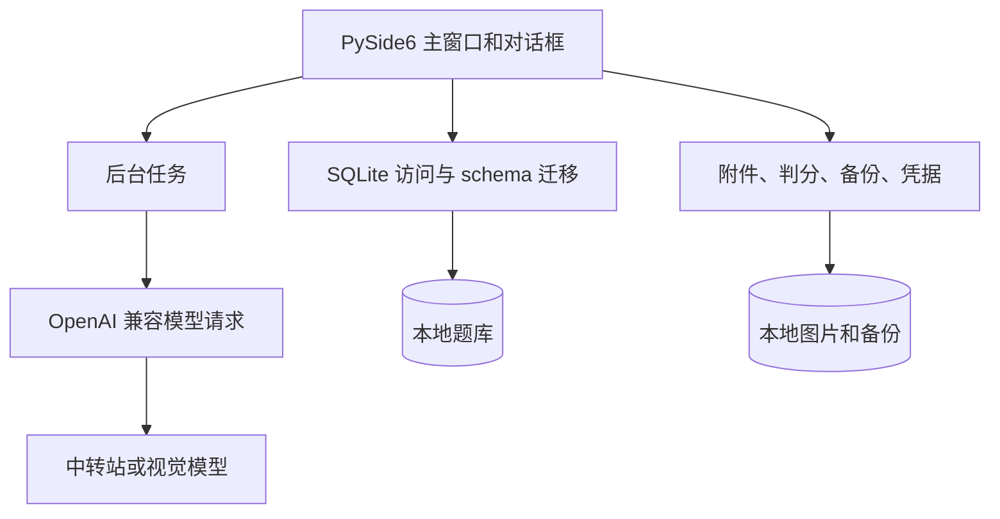

# AI 错题本开发手册

版本：0.1（项目启动手册）  
适用阶段：项目骨架与第一版开发  
依据：《错题本开发文档.md》《AI辅助开发指南.md》

## 1. 手册用途

本文把项目需求转换成可执行的开发步骤与协作约定。第 2 节及明确标注“当前”的内容来自现有源码核对；后续架构和开发顺序是目标建议，不代表相应功能已经实现。产品需求发生变化时，以用户最新确认的要求为准，并同步更新相关文档。

## 2. 当前项目状态

当前已有 PySide6 程序入口和本地题库流程：手动新增、编辑、删除、搜索题目；按学科、题型、错题标记、未练习和掌握状态筛选。题目图片可单独管理，也可直接拖放、粘贴或选择图片发起 AI 识题；Windows 支持全局快捷键 `Ctrl+Alt+S` 截图选区并自动开始识别。单张图片可返回多道题目草稿，逐题核对或移除后统一收录，原图关联到每道题。图片支持 PNG/JPG/JPEG/WEBP，最大 20 MB。

练习支持全部题目、错题、到期复习和随机顺序；开始练习会沿用题库页当前搜索及学科、题型、状态筛选，练习范围与页面条件取交集。提交后显示答案/解析并记录结果、用时、错因和掌握程度。单选、多选、判断和非主观题型使用规则判分（标准答案分隔符 `|` 表示可接受答案）；标记为解答、简答、主观、论述或证明等题型，以及缺少标准答案的题目，采用自评。规则判分是归一化文本比较，不是语义判分。复习间隔为掌握 7 天、还不熟 1 天、不会立即到期；答错会自动标为错题。练习记录窗口展示最近 500 条记录。

“设置 → 模型服务”支持多个 OpenAI Chat Completions 兼容配置，可分别设置基础地址、请求路径、模型、API Key、超时和视觉能力；可通过 `GET /models` 获取模型列表，也可手动填写模型 ID。识题时选择 Profile，尚未提供默认模型设置。远程地址要求 HTTPS。本地 API Key 存在系统凭据管理器中，不进入数据库备份。图片识题提示预设位于 `app/prompts.py`（尚未做提示词版本管理），优先请求 JSON 模式，不兼容时回退为提示词约束。

“数据”菜单支持备份和恢复；恢复前验证数据库、附件路径和 ZIP 内容，并自动创建当前数据的恢复前备份。SQLite schema 当前为 v4，可从 v1 逐级迁移。题库数据库及附件位于源码项目下的 `data/` 目录，暂不支持更改数据目录。尚未实现知识点/标签/年级/来源等筛选字段、厂商原生 Gemini/Grok 接口、AI 聊天、Windows 安装包、云同步。最近代码改动尚未启动验收；本次只核对源码和文档，没有运行测试。

## 3. 产品范围与原则

- 面向单个学生的 Windows 桌面应用，默认本地保存题库、附件和答题记录。
- AI 识别、分类、答案和解析均先作为草稿展示；用户确认后才进入正式题目。
- 原始题干和原图不得被模型输出覆盖。识别失败不能丢失导入图片。
- 支持多个模型服务和 API 中转站配置。每项配置独立保存地址、模型、密钥引用、超时和能力信息，并可测试、选择和切换。
- 服务商的原生接口与 OpenAI 兼容接口分开适配；不能假设只替换基础 URL 就一定兼容。
- 本地录题、浏览和练习不依赖网络。网络请求和图片处理不能阻塞 Qt 主线程。
- 优先完成小而完整的用户流程；不要提前加入云同步、多用户或插件系统。

## 4. 环境准备

### 4.1 Windows 开发环境

需要 Python 和 pip。建议为项目使用独立虚拟环境。在 PowerShell 中：

```powershell
cd D:\project
python --version
python -m venv .venv
.\.venv\Scripts\Activate.ps1
python -m pip install --upgrade pip
python -m pip install -r requirements.txt
```

如 PowerShell 激活脚本受本机策略限制，可不激活环境，直接使用虚拟环境解释器：

```powershell
.\.venv\Scripts\python.exe -m pip install -r requirements.txt
```

PySide6 的 pip 安装包带有运行 Qt 应用所需的组件，一般不需要再单独安装 Qt SDK。SQLite 使用 Python 自带的 `sqlite3` 模块，不另装数据库服务。

### 4.2 依赖管理

- 每个项目依赖都必须有明确用途；优先标准库和已有依赖。
- 依赖选定后写入项目依赖清单（建议 `requirements.txt` 或 `pyproject.toml`），不要只依赖开发者机器上的全局安装。
- 当前模型 HTTP 请求使用 Python 标准库 `urllib.request`，密钥由 `keyring` 管理，图像显示/处理依赖 PySide6；不要为已有能力重复引入依赖。未来新增依赖时先确认必要性并写入依赖清单。
- 不在源码、示例配置、日志或 SQLite 中保存明文 API Key。

项目运行依赖可一次安装：`python -m pip install -r requirements.txt`。模型服务配置使用 Python `keyring` 接入 Windows 系统凭据存储；题库备份不会包含 API Key，换机器或恢复备份后需重新录入。

### 4.3 启动约定

应用入口建议为根目录的 `main.py`。入口创建 Qt 应用对象并打开主窗口；业务规则、SQL 和模型 HTTP 请求不写在入口文件中。入口文件创建后，可从项目根目录用以下命令启动：

```powershell
python main.py
```

## 5. 目录职责

### 5.1 当前实际目录

```text
app/
├─ database/       # SQLite 连接、schema 版本和迁移
├─ prompts.py      # AI 识题 system/user 提示预设
├─ services/       # 录题、练习、AI 识别和备份等应用流程
└─ ui/             # PySide6 窗口、页面和表单
data/
├─ questions.db    # 首次运行后创建的本地 SQLite 数据库
└─ attachments/    # 确认收录后保存的原图
```

当前没有独立的 `repositories/`、`domain/`、`providers/` 或迁移脚本目录；题库读写集中在 `app/database/store.py`，模型请求在 `app/services/model_provider.py`。

### 5.2 建议逐步增加的模块

```text
app/
├─ domain/         # 题目等领域对象和校验规则
├─ providers/      # OpenAI 兼容适配器及厂商原生适配器
├─ storage/        # 图片文件和备份文件操作
└─ prompts/        # 集中管理并标记版本的 AI 提示词
migrations/       # 按版本排序的 SQLite schema 迁移
```

只在对应功能开始时增加目录和模块。个人数据与源码分离；正式版的数据目录应使用应用数据目录配置，不应依赖源码当前工作路径。不要把个人题库、图片或密钥提交到版本库。

## 6. 模块边界和数据流

核心业务闭环是“收集题目 → 整理并确认 → 练习作答 → 记录结果 → 定期复习”。题库保存、搜索、手工录入和练习本地运行；模型服务只辅助识题和后续可选的反馈。

当前程序调用关系：



目标数据流（当前代码尚未完全按此分层）：

```text
PySide6 UI
  -> Application services
      -> Domain models / validation（规划中）
      -> Repositories（当前由 app/database/store.py 承担） -> SQLite
      -> Storage（当前分布在相关服务中） -> 图片/备份文件
      -> Model providers -> 外部模型 API
```

- **UI**：展示页面、收集用户输入和明确确认；当前部分 UI 直接调用 `store` 数据访问函数，后续可再抽应用服务层。
- **Application services**：编排录入、识别草稿确认、练习和备份等完整操作。
- **Domain**：表达题目、答案、掌握状态等核心数据和校验规则。
- **SQLite 数据访问**：当前由 `app/database/store.py` 封装查询与写入。
- **Storage**：负责附件复制、内部命名、预览路径与备份文件操作。
- **Providers**：封装模型服务请求、协议差异、错误映射和响应结构校验；不能直接修改正式题库。

耗时操作通过 Qt worker、线程池或合适的异步机制执行，并将加载、成功、失败和取消状态反馈到界面。不要在主线程等待网络响应或大型图片处理完成。

## 7. 推荐开发顺序

每个阶段完成一个可见的用户流程，再进入下一阶段。

已有功能包括手动题库、图片识题、OpenAI 兼容 Profile、练习复习和备份恢复；题库页筛选条件已可传入练习集。后续优先级按实际用户闭环安排，不需要为规划中的模块先搭空架子。

1. **应用骨架**：`main.py`、主窗口、中文界面基础布局、日志和配置目录。
2. **本地数据基础**：SQLite 连接、外键约束、schema 版本和第一份 migration。
3. **题目闭环**：题目领域对象、Repository、手动新增/编辑/删除、列表和题干搜索。
4. **图片附件与 AI 识题**：支持手工附件管理；单张识题图片可拆分为多道草稿，逐题核对后统一收录并关联原图。
5. **练习闭环**：练习集、隐藏答案、提交自评、揭示答案解析、记录用时和结果。
6. **复习基础**：错题标记、掌握状态、简单可解释的到期规则；规则集中配置。
7. **模型配置与识题**：已实现多个 OpenAI 兼容 Profile、系统凭据存储、模型列表、连接测试、自定义路径和可编辑识题草稿；原生服务商适配仍待实现。
8. **备份恢复**：已实现数据库和附件备份、恢复校验及恢复前备份。
9. **当前优先改进**：完成程序启动和核心流程验收，重点核对筛选练习、多题识别与批量收录、备份恢复。
10. **后续交付**：先确定是否要保存用户作答内容，再按需增加知识点/标签字段；Windows 安装包前迁移数据到稳定的用户数据目录。只有确有需求时再增加原生 Gemini/Grok 适配和 AI 判题。

不要在第 3 阶段之前把 AI 识别当作录题的必要条件；手动录题必须始终可用。

### 7.1 当前功能的使用顺序

1. 运行 `python main.py`。
2. 打开“设置 → 模型服务”，为每个中转站分别填写 API 基础地址、请求路径和 API Key；常见填法是基础地址填写到 `/v1`，请求路径保持 `/chat/completions`。点击“获取模型列表”后可选模型；不开放模型列表的中转站仍可手动填写模型 ID。保存时会先校验字段，勾选视觉能力后测试连接，配置有改动时需重新测试。
3. 点击“AI 识题”，可拖入图片、点击“粘贴图片”粘贴已复制的图片/图片文件，或选择本地图片；也可直接把图片拖到主窗口。Windows 下可在任意窗口按 `Ctrl+Alt+S` 框选题目区域，应用会自动开始识别。选择视觉模型后逐题对照原图编辑草稿；可移除误拆的草稿，确认后分别收录并将原图关联到每道题。
4. 开始练习并提交答案。客观题显示系统判定；主观题选择自评结果。

识题提示预设集中在 `app/prompts.py`，要求模型按 `questions` 数组返回独立题目、转写完整条件并尝试作答；同一题号的小问保持在一个草稿中。请求优先启用 JSON 模式，若中转站明确不支持则自动退回提示词约束。结果仍作为草稿，需人工核对。

当前按 OpenAI Chat Completions 请求格式发送请求，并允许每个中转站自定义请求路径；“获取模型列表”使用兼容的 `GET /models` 接口。部分中转站不开放模型列表时，可手动填写模型 ID。图片识题还要求接口支持图片输入。远程地址要求 HTTPS，本地服务可用 HTTP。

## 8. 数据与迁移约定

- 数据库 schema 使用显式版本号和有序 migration；禁止只在启动代码中临时补列。
- SQLite 连接启用外键；涉及题目、附件和答题记录的多步写入放在事务中。
- 题目可缺少答案、解析或分类字段；空字段不应阻止保存。
- 当前实际题库字段为 `stem`、`subject`、`question_type`、`answer`、`explanation`、`is_wrong` 和时间戳；年级、知识点、标签、选项、难度和来源仍是规划字段。
- 初期至少规划 `questions`、`attachments`、`practice_attempts`、`review_state` 和 `model_profiles`。
- 删除题目时明确附件策略，避免误删仍被引用的文件或遗留无主附件。
- 恢复备份前检查文件结构和目标位置，不静默覆盖当前数据。

## 9. 模型服务与中转站接入约定

当前 Profile 包含显示名称、OpenAI 兼容类型、API 基础地址、请求路径、模型 ID、超时、视觉能力、启用状态和 Key 引用；系统凭据管理器保存密钥。请求支持 Chat Completions 格式和自定义路径；模型列表使用 `GET /models`。不兼容该请求/响应协议的中转站和原生 Gemini/Grok API 尚未适配。

多个中转站必须能分别保存和切换，不能用一个全局 URL 或密钥覆盖所有配置。适配器需要清楚说明自己支持的请求路径、认证方式、文本/图片输入和结构化输出格式。连接测试与真实请求都不得记录密钥或完整认证头。

识别流程如下：

1. 用户拖放、粘贴或选择本地图片，并选择已启用视觉能力的 Profile。
2. 图片和 `app/prompts.py` 中的识题预设发送到所选模型。
3. 解析 JSON 题目列表并显示原图与逐题可编辑草稿；图片错误、接口错误或 JSON 无效时提示失败。
4. 用户确认后批量新建题目，并将原图复制为每道题的附件；取消时不写入题库。

失败、超时、模型拒绝图片、格式不兼容和结构化输出解析失败都应保留题目与附件，并给出下一步操作提示。

## 10. 图片和用户文件

- 只接受 PNG、JPG/JPEG、WEBP；导入/识题时检查类型、可解码性和 20 MB 大小上限。
- 用户原文件名不可信，复制到应用数据目录时生成内部唯一文件名。
- 原图不被 OCR、缩放或压缩操作覆盖；预处理结果如需保存，作为独立派生文件。
- 识别失败或取消时，外部原图保持不变；剪贴板图片的临时副本随识题窗口关闭清理。用户可重新粘贴/选择图片或手动录题。
- 所有附件路径使用相对于数据目录的记录，避免绑定到原始导入路径。

## 11. 每项开发工作的完成标准

- 用户能够通过界面完成本次功能对应的操作，失败时能理解并恢复。
- 数据在重启后仍一致；schema 变化通过 migration 管理。
- AI 草稿未经确认不会覆盖正式内容；密钥不出现在普通日志、明文配置或数据库中。
- 检查空值、重复导入、长题干、网络失败和附件缺失等相关异常分支。
- 汇报涉及的文件、用户可见变化和实际执行过的验证；没有执行的验证要如实说明。
- 不顺带做无关重构，不覆盖用户现有数据，不把临时文件、题库或密钥加入版本控制。

## 12. 文档索引

- [错题本项目说明](错题本项目说明.md)：产品目标、边界和文档入口。
- [错题本开发文档](错题本开发文档.md)：详细需求、数据模型和验收标准。
- [AI辅助开发指南](AI辅助开发指南.md)：与 AI 编程助手协作时的约束和模型适配约定。
