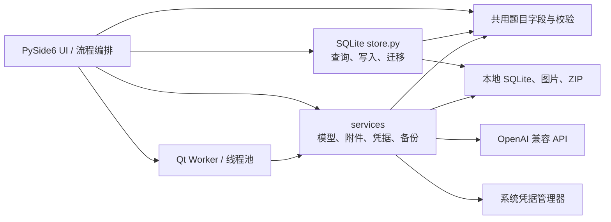

# AI 错题本开发文档

版本：0.1（需求草案）  
产品形态：Windows 优先的学生个人桌面程序  
建议技术栈：Python、PySide6、SQLite

> 本文保留第一版的产品需求目标，不代表每项需求都已交付。当前源码状态见下表；未列为“已实现”的字段/流程仍按规划处理。

## 当前实现状态（2026-10-03）

2026-10-03：默认启动页改为“学习首页”，展示截图识题、题目练习、英语背单词和我的题库四个功能入口，以及真实题目/错题/到期题目/单词数量和复习提醒。手动录题、练习记录、设置提供快捷入口；原列表与详情保留在“我的题库”。首页复用现有业务流程和 Qt 组件，没有新增依赖；小窗口内容可滚动。检查：`.venv/Scripts/python.exe checks/check_home.py`。

已加入可选 DeepSeek 网页版本地服务入口：设置页可启动服务、打开管理页及复制随机管理密码，并复用现有 OpenAI 兼容配置和图片草稿流程。独立服务已安装并验证本地鉴权、模型列表与未配置账号提示；真实识图尚待用户在本机添加网页 Token 后验证。额外环境本机约 63.6 MiB，无浏览器内核；不纳入题库备份。安装与操作见 [DeepSeek网页版接入.md](DeepSeek网页版接入.md)。

| 范围 | 当前状态 |
| --- | --- |
| 数学公式 | 识题草稿和手动编辑支持公式预览/源码编辑；题库列表、详情、练习、小窗及 PDF 共用离线排版。新增 ziamath 依赖，数据库保留原文，不支持的公式回退原文；草稿滚动且底部按钮固定。 |
| 界面组件 | 奶白和浅粉色底色、深玫瑰色主要操作；统一按钮、输入框、下拉框、勾选框、标签页、列表与滚动条样式。题目列表区分题干和学科/题型；图片拖入有高亮反馈；模型配置空列表有引导。使用 Qt 样式及本地 SVG，无新增依赖。 |
| 界面动效 | 页面、题目详情、答案标签、识题草稿和练习内容更新支持短时淡入；主要按钮支持悬停过渡和按下反馈。使用 Qt 原生动画，不增加依赖；内容淡入结束后释放效果，支持快速切换。 |
| 题目 | 已支持手动新增、编辑、删除、搜索；题库采用导航、题目列表和详情三栏布局，列表与详情宽度可调整，选中后直接查看完整题干及答案解析。题目字段为题干、学科、题型、答案、解析、错题标记、标签、知识点、难度、来源及结构化选项。 |
| 选择题选项 | 手工录题、AI 草稿、题库文件共用标号 → 内容的选项对象，2～12 项或留空。练习按题型显示单选/多选控件，按有效标号判分；选项支持公式。旧题原文保留并继续手输答案，不自动拆出选项。 |
| 图片识题 | 支持 PNG/JPG/JPEG/WEBP、单张最大 20 MB；可拖放、粘贴图像/图片文件或选择本地文件。截图快捷键可自定义，默认 `Ctrl+Alt+S`；截图入口不再单独占用侧栏。侧栏不设置 AI 识题板块；顶部“截图识题”或快捷键框选后自动弹出临时窗口，图片输入与草稿在该窗口内切换，主窗口保留原页面。一张图可识别多道题，草稿可逐题核对或移除，确认后分别新建题目并关联原图；同时兼容旧版单题响应。 |
| 附件管理 | 已支持题目图片多张添加、预览、移除；AI 识题每次处理一张图片，但可从该图生成多道题。 |
| 题库筛选 | 已支持学科、题型、错题、未练习和掌握状态。支持难度筛选、标签/知识点/来源文本搜索；年级、标签独立选择器和排序设置尚未实现。 |
| 筛选练习 | 练习页直接选择全部或某个学科，并组合全部题目、仅错题、到期复习范围；首次打开默认选中题库当前学科。默认不受题库其他筛选影响，勾选“沿用题库的搜索、题型和状态筛选”才额外取交集；支持随机顺序和每轮 1～200 题，默认最多 20 题。 |
| 小窗练习 | 可在练习配置页勾选，或在练习过程中切换；约 480×640，可拖动、调整大小、切换置顶，长内容支持滚动。同一练习实例在主窗口与小窗之间移动，保留当前作答及进度；展开、关闭小窗或按 Esc 返回完整界面。无新增依赖。 |
| 英语背单词 | 独立词条管理、分组与搜索，支持 TXT/CSV 导入（可只有英文），缺释义时进入草稿页；所选 OpenAI 兼容模型可补全中文释义、IPA 音标及双语例句，核对确认后收录。系统英语语音支持离线发音、语音选择、重启保留的五档语速及翻卡自动朗读，拼写模式揭示答案后才允许发音。提供英文翻卡、释义提示拼写、新词/到期范围、每轮 1～200 个及固定间隔复习。10 个可选示例词，单词和进度纳入备份；自动翻译需网络，其余可离线使用，无新增依赖。尚无完整考试词库。 |
| 模型服务 | 已支持多个 OpenAI Chat Completions 兼容 Profile、自定义请求路径、Key、超时、视觉能力、启用状态、连接测试和 `GET /models` 模型选择；不提供模型列表时可手动输入 ID。识题时选择 Profile，尚无默认模型设置。原生 Gemini/Grok 等接口尚未实现。 |
| 刷题和判分 | 已支持全部/错题/到期范围、随机顺序、答案揭示、作答记录、用户答案和错因；历史记录可查看用户答案。判分为文本归一化/精确比较，不是语义判分；主观题自评，纯数字及简单 LaTeX 分数支持精确数值比较，其他不一致的公式仍交给自评。答错会自动标错，暂不支持在练习结果区单独切换错题标记。 |
| 复习 | 设置页可调整已掌握/还不熟/不会三种间隔，0～365 天，默认 7/1/0。只影响后续记录，不重排已有到期时间；配置进入 ZIP 备份，单词规则独立。尚无自适应算法。 |
| 题库文件 | JSON/CSV 完整校验后进入可编辑草稿，确认后事务导入并跳过完全重复题；最多 5 MB / 5000 道。支持全部或当前筛选导出，PDF 可包含答案解析和常见公式。文字文件不含图片及历史，PDF 不支持重新导入。 |
| 学习统计 | 全量题目作答的累计正确率、学习天数、用时、学科表现、近七天及常见错因；跳过不计入正确率分母，自评计入，单词暂不纳入。 |
| 重启恢复 | 手动录题草稿和题目练习队列、输入、揭示状态等自动保存；记录和下一题检查点同事务，结束本轮保留已记录历史。识题任务、单词导入/编辑草稿及翻卡/拼写也支持恢复；恢复不自动调用模型，背诵记录和下一卡片同事务。 |
| 备份 | 已支持数据库和附件 ZIP 备份、恢复校验、恢复前备份；恢复校验选项和复习设置，旧 schema 逐级迁移。系统凭据中的 API Key 不在备份中，恢复后需重新录入。 |
| 交付 | 已生成并检查 Windows 安装版和免安装 ZIP，本地版本 0.2.0-preview.1 尚未上传 GitHub。Windows 11 实际运行及安装/卸载通过；无云同步、账号、多用户，尚未完成所有使用环境的用户验收。 |

以下各章继续描述产品目标。若目标与上述当前状态不同，以目标作为后续需求，不要据此宣称功能已经实现。

本次选项、复习设置、草稿/背诵恢复已通过临时数据库与模拟调用检查，详见开发手册 2.2；现有兼容模型完成简单两题识图，最终打包版完成 Windows 11 运行、发音/语速、热键回调及安装/卸载检查，范围见 [Windows 构建与交付](Windows构建与交付.md)。此处“已支持”指实现状态，GitHub 已发布预览包不自动包含后续源码修改。

特别说明：文中的“OCR/视觉模型”指目标支持的图像识别能力；当前实际流程是把单张图片发送给所选 OpenAI 兼容视觉模型，没有独立的本地 OCR 引擎。模型会尝试按题目边界拆分，但需人工核对；同一大题的小问保留在同一题目草稿中。文中的数据模型、界面清单和验收标准同样是目标设计，实际字段和已交付行为以状态表为准。

## 业务需求分析与实现优先级

### 核心业务闭环

项目服务单个学生，核心价值是缩短收题和整理时间，并让题目可以反复练习、复习：

**收集题目 → 整理并确认 → 练习作答 → 记录结果 → 定期复习**

题库的本地保存、搜索、手动录入和练习不应依赖网络；AI 是识题和反馈的辅助能力。AI 输出必须可编辑、可拒绝，未确认的内容不能写入正式题库。模型中转站是可替换的外部服务配置，不应成为题库核心流程的前置条件。

### 当前主要差距

1. 规则判分支持归一化文本及纯数字精确数值比较，不能可靠判断复杂数学等价式、同义表达或开放题；主观题仍由用户自评，不提供部分得分。
2. 当前模型服务用于图片识题、单词自动补全、连接测试和模型列表获取；文本补全复用同一 OpenAI 兼容请求方法，没有 AI 聊天或 Gemini/Grok 原生适配器。
3. 已改为稳定用户数据目录：Windows 默认 `%LOCALAPPDATA%\FlandreNotebook\data`；启动服务负责旧项目学习数据的暂存复制、升级、校验和整体启用。设置页可打开目录；目标已有题库时不自动合并。迁移已通过独立临时数据检查，旧文件保留；本机个人题库未迁移。指定绝对路径 FLANDRE_DATA_DIR 时不自动导入旧项目数据。
4. 多题拆分由模型按题目边界判断，复杂排版下可能误拆或漏题；逐题草稿核对和移除是必要的人机确认环节。

### 建议实现顺序

1. **多题图片识别已实现**：模型返回题目列表，用户可逐题核对或移除；确认后分别收录并关联原图。
2. **作答记录已补齐**：用户答案与结果、用时、掌握程度和错因一起保存在本地历史记录中；语义判分仍等真实需求出现后再评估。
3. **分类与练习**：已加入标签、知识点、难度、来源、结构化选项和可配置复习间隔；草稿/背诵恢复、稳定数据目录及打包已完成本地检查，标签选择按需求补充。
4. **Windows 交付**：目录迁移、安装版及免安装版已完成本地检查；当前仅本地生成，发布前核对版本与摘要，Windows 10 及真实 DeepSeek 网页识图尚未实测。
5. **按实际需求扩展模型接口**：确有原生 Gemini/Grok 用户需求时再添加对应适配；当前 OpenAI 兼容中转站能力继续保持简单可用。

以上顺序优先补齐已存在的业务流程断点；新分类、语义判分和原生服务商适配应由具体使用需求驱动。

## 1. 项目目标

开发一款个人本地题库与错题复习工具。用户可用文字或图片录入题目，借助 AI 识别和整理，经人工确认后保存；题目随后可被筛选并用于练习。应用支持可配置的多家模型 API。

## 2. 产品原则

1. **先可靠保存，再做智能处理**：原始题目文字与导入图片不得被识别结果覆盖。
2. **AI 输出需确认**：识别、分类、答案和解析均作为草稿展示，用户明确确认后才写入正式题目。
3. **题目库是统一集合**：错题、普通练习题和导入题可同库存放，以标记、来源和标签区分。
4. **本地优先**：无网络时，手动录入、浏览、搜索和练习仍可使用；AI 能力在网络/API 可用时启用。
5. **服务商可替换**：应用逻辑不直接依赖某一家模型厂商的 SDK 或返回格式。

## 3. 用户与范围

### 3.1 目标用户

单个学生，用于个人收题、整理、练习和复习。

### 3.2 第一版包含

- 手动创建和编辑题目
- 拖入或选择图片直接发起 AI 识题；确认识别草稿后将原图一并存为题目附件
- 图片预览、OCR/视觉模型识别、识别草稿人工确认
- 题目列表、搜索、筛选、详情查看
- 按筛选结果练习、随机练习、错题练习
- 答题结果、用时、错因和掌握程度记录
- 基础到期复习队列
- 服务商配置、连接测试、模型选择
- 数据备份和恢复

### 3.3 第一版不包含

账号、多用户权限、教师班级/作业、云同步、手机端、公开题库、自动组卷、PDF/Word 批量导入、手写公式的可靠结构化识别。

## 4. 功能需求

### 4.1 题目录入与编辑

- 支持题干、选项、标准答案、解析、学科、年级、知识点、题型、难度、来源、日期、个人笔记等字段。
- 题目可以没有答案或解析；信息不完整仍可保存为草稿/题目。
- 支持单选、多选、判断、填空、解答等类型。题型字段允许扩展，不应要求用户先选题型才能保存。
- 一个题目可关联多张图片；原始图片独立保存，不将其压缩覆盖。
- 题目支持“错题”标记及用户自定义标签。
- 删除题目时提供确认；关联附件按明确的删除策略处理，避免孤儿文件或误删。

### 4.2 图片导入和识别

- MVP 接受常见图片格式（PNG、JPG/JPEG、WEBP；具体解码能力由所选图像库决定）。
- 导入时复制到应用数据目录并生成唯一文件名，数据库不依赖原文件路径。
- 一张图片可以识别出多道独立题目；同一题号的多个小问保留为一个题目草稿，确认后分别入库。
- 识别结果至少应包含可编辑的题干文本；模型支持时可另外返回选项、答案、解析及分类建议。
- 识别请求失败时保留图片并允许重试或手动录入。
- 原图和识别草稿应同时可查看；用户确认之前不自动提交答案或解析。
- 对低清图、手写内容、复杂公式和表格，允许识别不完整，不承诺无误识别。

### 4.3 题库浏览与检索

- 支持按题干文本搜索。
- 支持按学科、知识点、题型、来源、标签、错题标记、掌握状态筛选。
- 支持按创建时间、最近练习时间排序。
- 列表展示题干摘要、学科/题型、错题状态、掌握状态和最近练习信息。

### 4.4 刷题与复习

- 练习集可由用户当前筛选条件生成，支持顺序和随机两种顺序。
- 答题阶段默认隐藏答案和解析；用户提交答案后揭示答案与解析。单选、多选、判断和普通文本答案可按明确规则自动判分；主观解答或缺少标准答案的题目采用自评。
- 每次作答保存时间、结果（正确/错误/跳过/自评未知）、用时和可选错因。
- 答题后可标记“已掌握/还不熟/不会”，并可切换错题标记。
- 提供“全部题目”“错题”“到期复习”练习入口。
- 第一版复习规则简单、可解释：按三种掌握程度配置整数天数，默认 7/1/0；规则集中存入 SQLite，设置与练习复用同一读取入口。修改不重排已有到期时间。
- 暂不宣称科学的自适应记忆算法；后续可依据实际答题数据迭代。

### 4.5 AI 模型服务

目标兼容 OpenAI、Gemini、Grok，以及不同 API 中转站和自定义服务。用户可以同时保存多个服务配置，并在使用时选择或切换；不同中转站可分别配置显示名称、接口类型、API 基础地址、密钥、模型 ID、超时时间和能力。服务商与能力配置不能假设所有接口完全相同。

每个配置至少包含：显示名称、接口类型/适配器、API 基础地址、自定义请求路径、密钥、模型 ID、超时时间、视觉能力标记、启用状态。允许为不同中转站分别保存配置，不能只提供一个全局地址或密钥；密钥不回显完整值，测试连接不得把密钥写入日志。

支持能力：

- 文本问答/题目整理
- 可选的图片输入
- 识别草稿结构化输出
- 超时、HTTP 错误、认证失败、模型不存在、格式不兼容等可读错误
- 用户主动触发请求、取消长请求（若底层客户端支持）

设计约定：

- 通过统一的 `ModelProvider`/客户端协议向业务层提供文本与图片任务；多个 OpenAI 兼容中转站可使用独立配置接入和切换。
- 为厂商原生接口和 OpenAI 兼容接口分别设置适配器；不要把“改 base URL 就一定兼容”写死为假设。
- OpenAI 兼容中转站允许使用各自的 API 基础地址、请求路径、密钥和模型 ID；针对协议差异，明确标记适配范围并给出可读错误，不把更换基础地址视为必然兼容。
- 配置视觉能力，但仍需处理模型拒绝图片、图片过大、格式不支持等返回错误。
- 对兼容 `GET /models` 的中转站提供模型列表获取和选择；未开放模型列表接口的服务允许用户手动填写模型 ID。
- AI 返回内容先解析为 DTO/校验字段，再作为草稿交给界面；解析失败时保留原始响应用于诊断（不得含密钥），不静默丢弃。
- 提示词版本集中管理，限制模型只返回约定结构；用户编辑后的内容优先于再次生成结果。

### 4.6 设置、备份与恢复

- 设置模型服务、默认模型、数据目录和基础界面偏好。
- API 密钥优先使用操作系统凭据存储；若目标环境不能使用，采用经过审查的本地加密方案，不以明文 JSON/SQLite 保存。
- 备份包括 SQLite 数据库及图片附件，恢复前验证备份结构并避免静默覆盖现有数据。
- 明确展示备份位置、最近备份时间和恢复目标。

## 5. 主要界面与导航

- **题库**：列表、搜索、筛选、新增入口。
- **收录题目**：手动编辑器和图片导入/识别确认。
- **题目详情**：题干、图片、答案、解析、笔记、标签及历史作答。
- **开始练习**：选择全部/错题/到期复习及筛选条件。
- **练习中**：题目展示、作答区、提交/揭示答案、上一题/下一题。
- **练习结果**：本轮统计、错题回看、返回继续练习。
- **设置**：模型服务、连接测试、数据位置、备份恢复。

## 6. 系统架构与实现边界

### 当前架构（以源码为准）

`app/ui/math_text.py` 统一公式预览与源码编辑，使用 ziamath 和现有 Qt 绘制，不改数据库结构或将预览图片写入附件。

当前是无服务端的单体桌面应用。PySide6 主窗口通过 `QStackedWidget` 切换题库、题目编辑、练习、历史、附件和设置页面，识题与草稿由按需打开的临时窗口承载；界面也编排部分业务流程；`app/database/store.py` 集中执行 SQLite 查询、写入和 schema 迁移；`app/services/` 提供模型请求、凭据、附件和备份等功能。图片识别和模型配置网络请求使用 Qt Worker 在线程池运行，避免阻塞主界面。普通状态显示在页面内，文件选择和破坏性操作仍保留系统对话框或确认提示。

模块位置：

- `app/ui/`：主窗口、题目表单、识题草稿、模型配置、练习、历史、截图和后台 Worker。
- `app/database/store.py`：SQLite schema 初始化/迁移及题目、附件、作答、复习状态、模型配置的读写。当前 schema v9；v6 增加 vocabulary_words，v7 增加题目分类，v8 增加 workspace_state，v9 增加选项与 review_preferences。
- `app/question_data.py`：共用题目字段、草稿/正式校验、选项解析与数据转换，不依赖 Qt；store、Provider、文件导入和 UI 复用。
- `app/ui/options_editor.py`：共用选项编辑组件，不写入数据库；`review_settings.py` 收集复习天数并委托 store 保存。
- `app/services/question_files.py`：共用题目格式的 JSON/CSV 往返、事务导入、重复跳过与公式 PDF 导出。
- `app/services/recognition_drafts.py`：按任务保存识题原图和草稿，校验任务与图片路径，恢复过程不调用模型。
- `app/services/attachments.py` 与 store：整批校验并复制正式图片，再用一个事务收录题目、关联原图和清除草稿，失败回滚。
- `app/services/model_provider.py`：OpenAI Chat Completions 兼容请求、模型列表、连接测试、视觉输入和响应解析；不实现厂商原生 Gemini/Grok 协议。
- `app/services/attachments.py`、`backup.py`、`credentials.py`：本地图片文件、ZIP 备份/恢复和系统凭据管理。
- `app/paths.py`：资源与稳定用户数据路径，旧学习文件的暂存复制；`app/services/storage.py`：启动时协调迁移校验与数据库初始化，数据库层不反向依赖服务；`backup.validate_data_directory()` 共用于旧数据迁入和 ZIP 恢复。
- `app/prompts.py`：识题与单词自动补全的 JSON 提示词预设。
- `app/database/vocabulary.py`：单词、复习状态及 TXT/CSV 解析和原子导入。
- `app/services/vocabulary_translation.py`：复用模型请求并严格核验补全词条，不直接写入数据库。
- `app/ui/pronunciation.py`：Qt 系统英语语音；`vocabulary_page.py` 管理单词库、编辑、背诵、导入草稿和后台分批补全。

当前 UI 直接调用 `store.py`，题目格式和校验已集中到 `question_data.py`，没有独立 repository 类或多层 application-service。格式转换、判分和文件服务复用共用规则；当出现可复用的复杂业务流程或第二种 API 协议时，再拆出对应编排/适配逻辑。

### 核心流程

1. **图片识题**：截图或图片输入按需打开临时识别窗口，保留主窗口当前页面；校验格式和大小，模型请求前按边长缩小副本；后台调用当前 Profile；在同一识别窗口中展示多题草稿；用户编辑/移除并确认后整批写入 SQLite 并关联已复制的原图，题目/附件/草稿清除同事务；未确认任务保存到本地以便恢复。单题旧格式兼容；模型/API 失败时在窗口状态区显示错误并保留图片，题库不写入未确认草稿。识别中禁止替换原图；关闭窗口先隐藏并丢弃迟到的结果，当前请求返回/超时后清理临时图和窗口。
2. **练习与复习**：主窗口把搜索和筛选条件传给题目查询；练习页显示题目、收集作答并揭示答案；规则题由 `grading.py` 比较规范化文本，主观题自评；点击“记录并继续”后在一个 SQLite 操作中保存用户答案及作答信息、更新复习状态和错题标记；历史页读取最近记录。
3. **备份恢复**：备份数据库及附件到 ZIP；恢复先检查 ZIP 内容、数据库完整性和相对附件路径，自动生成当前数据的恢复前备份，再安装还原的数据；旧数据库通过 schema 版本迁移升级。
4. **单词学习**：TXT/CSV 全文件校验（5 MB/5000 条上限）→ 完整词条直接原子导入，缺释义词条进入草稿 → 可编辑或经现有 Worker 每批 20 个单词补全 → 核对并确认导入 → 翻卡/拼写与本地发音 → 记录掌握程度和下次时间。模型输出保留用户原字段；失败可重试剩余部分，停止后不再发下一批，当前请求等待返回/超时且结果丢弃。草稿和卡片支持跨重启恢复，恢复不自动请求模型或朗读；发音依赖系统英语语音，AI 翻译依赖可用的网络模型。

### 后续扩展原则

- 新流程先复用当前 store/service；只有 UI 里重复出现的复杂业务规则才抽为应用服务。
- 第二种厂商原生协议出现时，再增加适配实现；不要只替换 URL 就声称兼容。
- 数据结构变化通过递增 `SCHEMA_VERSION` 并编写可重复执行的逐级迁移；不要要求用户删除数据库。
- AI 输出始终先解析和核验为草稿，不由 Provider 直接写数据库。

## 7. 初步数据模型

### `questions`

- `id`：UUID 或整数主键
- `stem`：题干文本
- `question_type`：可空的题型标识
- `subject`、`grade`、`knowledge_points`：可空分类字段；知识点可独立关联表
- `options`：当前 SQLite 列为 JSON 文本，默认 `'{}'`；内存和 JSON 导出为 `{"A":"文字","B":"文字"}` 对象。标号为 A～Z，正式内容 2～12 项或空对象，每项最多 20000 字；草稿允许暂存未填完整选项。选项标号保留，删除不重排。
- `answer`、`explanation`、`notes`
- `is_wrong`：是否作为个人错题
- `source`、`difficulty`
- `created_at`、`updated_at`、`deleted_at`（如采用软删除）

### `attachments`

- `id`、`question_id`、`relative_path`、`original_name`、`mime_type`、`created_at`
- 路径相对于应用数据目录；实际删除时按引用关系处理。

### `practice_attempts`

- 当前字段：`id`、`question_id`、`answered_at`、`result`、`duration_seconds`、`mistake_reason`、`mastery`、`user_answer`。
- 用户答案在点击“记录并继续”时保存；旧记录的 `user_answer` 默认为空字符串。

### `review_state`

- `question_id`、`mastery`、`due_at`、`last_reviewed_at`、`review_count`

### `review_preferences`（已实现）

- 单行 `id=1`；`mastered_days`、`unsure_days`、`unknown_days` 为 0～365 的整数天数，默认 7、1、0。
- `record_attempt` 在同一数据库操作中读取规则并计算到期时间；保存设置不修改既有复习状态，备份恢复规则随数据库迁移。

### `model_profiles`

- `id`、`name`、`provider_type`、`base_url`、`endpoint_path`、`model_id`、`capabilities_json`、`timeout_seconds`、`enabled`；每个中转站作为独立配置保存
- `api_key_ref`：凭据存储引用，不保存明文密钥。

索引至少覆盖创建时间、错题状态、到期时间和常用分类字段。SQLite 连接启用外键约束；数据库升级使用显式 migration。

## 8. 非功能要求

- 目标平台：Windows 10 1809 或更新版本、Windows 11 x64；本轮 Qt 6.11.2 包在 Windows 11 实测，Windows 10 尚未实测。
- 普通列表和搜索在个人常见题量下保持响应；网络请求和图片识别不阻塞界面。
- 网络不可用时，本地题库核心能力可用。
- 数据写入采用事务；异常退出后数据库可恢复到一致状态。
- 日志不包含 API Key、完整认证头或不必要的题目隐私内容。
- 错误提示说明下一步可采取的动作，并保留可诊断错误信息。
- UI 支持中文内容、长题干、公式文本和不同尺寸窗口；不假设每道题都只有纯文本。

## 9. 关键验收标准

1. 用户可手动新建、修改、搜索、筛选和删除题目，重启后数据仍在。
2. 导入图片后原图在应用数据目录中保留，重新打开题目可预览。
3. 识别结果以草稿形式展示；用户修改并确认后才保存为正式题目。
4. AI 请求失败不会丢失题目或附件，且界面给出可理解的错误。
5. 题目可进入练习；答案揭示前不在练习视图中显示；每次作答有记录。
6. 错题和到期复习筛选可生成练习集，掌握状态变化会影响复习安排。
7. 可同时配置多个使用不同地址、密钥和模型的 OpenAI 兼容服务/中转站，并可测试连接和切换使用；接口适配设计允许增加原生 Gemini/Grok 连接器。
8. API Key 不以明文出现在数据库导出、应用日志或普通设置界面中。
9. 备份可在另一份空数据目录恢复，题目与图片引用保持有效。

## 10. 待产品确认项

- 是否第一版就接入原生 Gemini API，还是先交付 OpenAI 兼容接口再扩展。
- 默认用户数据目录已确定；可在启动前通过绝对路径 FLANDRE_DATA_DIR 指定独立目录，是否增加运行中迁移入口按实际需求决定。
- 已采用三种掌握程度的可配置天数；是否需要自适应复习算法仍按实际需求决定。
- 是否需要语义判分或部分得分：当前客观题按文本归一化比较，主观题由用户自评；练习答案已保存在历史记录中。
- 已有常见公式预览与源码编辑；完整 Markdown 和可视化公式编辑器仍未实现，按实际需求再扩展。
- Windows 安装版及免安装 ZIP 已实现，运行目标和验收边界见 [Windows 构建与交付](Windows构建与交付.md)。

