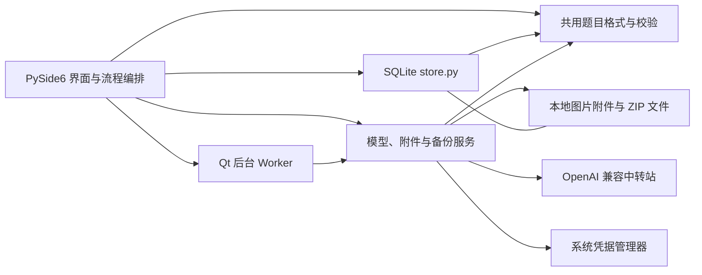

# AI 错题本项目说明

手机现已增加 DeepSeek 网页版本机接入，支持官方网页手动登录或填写自己的网页 Token；识题和单词补全不依赖电脑或额外反代服务，凭据加密并独立于账号同步。真实网页登录与图片识别尚待验收，操作见 [安卓说明](android/README.md)。

## 项目简介

一款面向学生个人使用的 Windows 桌面错题本。学生可以手动录入题目或导入题目图片，将整理后的题目保存到本地题库，按条件刷题，并记录答题情况与复习进度。AI 用于辅助识别、分类和讲解，所有识别与生成结果均由学生确认后保存。

2026-10-07 最新进展：Android 0.2.0-preview.5 已构建为独立错题本，无需电脑或云端登录即可录题、核对图片草稿、练习复习和背单词；支持离线公式、JSON/CSV、系统打印与备份。登录用于与电脑同步题目、原图、笔记和掌握状态，单词与详细作答历史仍保存在各自本机。137 项原生模拟器检查通过，真实模型、手机云端写回及实机流程仍待验收。Android 新版 APK 已发布到 [GitHub Release](https://github.com/flandre0605/flandre-notebook/releases/tag/android-v0.2.0-preview.5)；v0.4.0 的历史安卓附件仍为 0.1.0。最新范围见 [安卓说明](android/README.md) 和 [同步方案](手机端与账号同步方案.md) 8.10。

## 产品目标

- 让收集题目足够快：支持手动录入；图片可从文件选择、剪贴板粘贴或拖放后直接交给 AI 识题。
- 让题目真正可复习：题目进入个人题库后，可以筛选、随机练习和重做错题。
- 让 AI 帮忙但不替学生做决定：识别、分类和解析均可编辑，未经确认不覆盖原题。
- 默认本地管理：题目、图片和答题记录保存在本机；调用云端 AI 时只发送当前任务所需内容。
- 服务纸质刷题：手机负责快速收题，电脑负责核对、详细编辑和打印；联网时按账号同步，离线时保留本地修改。

## 目标用户与边界

现有桌面版为单套本地个人题库。后续通过一套后台支持多个独立账号，同一账号在手机与电脑互通；每个账号只能访问自己的题目、图片、笔记与复习数据。教师、班级、作业布置、公开题库和多人共同编辑暂不纳入。导入的练习题、试卷题和错题都可进入该用户的个人题库，并通过来源、标签或“错题”标记区分。

## 核心使用流程

以下流程记录现有电脑端能力。目标纸质刷题流程、手机待整理收件箱及正式题目确认规则见 [手机端与账号同步方案](手机端与账号同步方案.md)。

1. 学生手动录入题目，或选择/粘贴/拖入图片直接发起 AI 识题。
2. 图片提交给用户选择的视觉模型；识别完成后按题目拆分为可编辑草稿，并显示原图。
3. 学生逐题对照原图检查题干、学科、题型、答案与解析，确认后统一新建题目；原图关联到每道题。
4. 在题库中按学科、题型、错题或掌握情况筛选并开始练习；也可按难度筛选，按知识点、标签和来源文本搜索。
5. 答题后查看答案和解析，记录对错、用时、错因及掌握程度。
6. 在复习队列中重做到期题目，并查看个人练习记录。

## 第一版技术方向

- Python 3
- PySide6 桌面界面
- SQLite 元数据与练习记录
- 本地附件目录保存原图
- Python 标准库 `urllib.request` 连接模型服务
- Windows 优先，核心逻辑尽量保持跨平台

### 默认模型（2026-10-03）

设置页新增“默认模型”，识题仅列出已启用且支持视觉的配置，单词补全列出全部已启用配置；可选“自动选择可用配置”。选择保存到当前设备的 QSettings，重启保留，不进入题库 ZIP。新识题窗口与新建或编辑单词及导入词表的补全使用默认项，任务内手动选择优先，恢复识题草稿沿用任务中的配置。配置删除、禁用或失去视觉能力时回退可用配置，没有配置时禁用请求；刷新任务的配置下拉框不会主动调用网络。三个入口复用 `app/ui/model_selection.py`，没有新增运行依赖或数据库 schema。检查 `checks/check_model_selection.py` 覆盖独立进程重读、新任务采用最新默认、能力过滤、手动选择、草稿恢复、配置失效、取消默认、空列表和读取失败，使用临时设置和题库，不请求模型。

## 当前功能实现与系统架构

### 功能如何落地

学习数据默认放在 `%LOCALAPPDATA%\FlandreNotebook\data`，设置页可打开目录。启动服务协调旧项目数据的复制、schema 升级及校验，验证成功才启用新目录；旧文件保留，已有新题库不合并。迁移已通过独立临时数据检查，未迁移本机个人题库；指定绝对路径 FLANDRE_DATA_DIR 时不自动导入旧项目数据。资源路径、文件迁移、数据库事务和界面展示各自保持职责，详细规则见开发手册 8.1。

| 功能 | 当前实现 | 关键代码 |
| --- | --- | --- |
| 数学公式 | 题干、答案和解析支持常见 LaTeX 离线预览；草稿/编辑可切换源码，题库详情、完整与小窗练习共用。数据库保留原文，不支持时显示源码。草稿内容滚动，确认按钮固定。 | `app/ui/math_text.py`、`checks/check_math_preview.py` |
| 交互动效 | Qt 原生实现主要页面和内容淡入、主要按钮悬停及按下反馈；快速切换会停止旧淡入，结束后移除效果，不增加依赖。 | `app/ui/motion.py`、`app/ui/main_window.py` |
| 界面组件 | 奶白与浅粉主题，深玫瑰色强调主要操作；统一按钮、输入框、下拉、勾选、标签页、列表和滚动条。题目列表两行区分题干与学科/题型，图片拖入有高亮反馈；图标采用本地 SVG，不增加依赖。 | `app/ui/theme.py`、`assets/ui/`、`checks/check_theme.py` |
| 题库管理 | 首页采用左侧导航、中间列表、右侧详情的布局，列表与详情宽度可拖动调整；选中题目可直接查看题干、答案和解析，编辑及附件操作位于详情区。表单校验后写入 SQLite；列表搜索和筛选由数据库查询完成。 | `app/ui/main_window.py`、`app/database/store.py` |
| 图片识题 | 侧栏无独立识题板块，截图框选后自动弹出临时识别窗口；拖入图片也可打开该窗口，内部保留文件选择和粘贴。后台请求所选视觉模型，多题草稿在同一窗口内核对，确认后逐题入库并复制原图。 | `app/ui/main_window.py`、`app/ui/image_recognition_dialog.py`、`app/ui/recognition_draft_dialog.py`、`app/ui/screenshot.py` |
| 模型中转站 | 每个 Profile 单独保存名称、基础地址、请求路径、模型、超时及凭据引用；连接测试和 `GET /models` 在后台线程运行。密钥通过系统凭据管理器保存。 | `app/ui/profiles_dialog.py`、`app/services/model_provider.py`、`app/services/credentials.py` |
| 练习与复习 | 在练习页选择学科与全部题目、仅错题或到期范围，可勾选额外沿用题库的搜索、题型和状态筛选；规则题按归一化文本比较，主观题由用户自评；记录并继续时保存答案、结果、用时、错因和掌握度，并更新到期时间；提交后可展开个人笔记、调整错题标记，最终标记与作答和下一题进度同事务保存。 | `app/ui/practice_dialog.py`、`app/services/grading.py`、`app/database/store.py` |
| 练习历史 | 查询最近 500 次作答并展示题目、用户答案、判定、掌握度、用时和错因。 | `app/ui/history_dialog.py`、`app/database/store.py` |
| 小窗练习 | 可直接以小窗开始或在练习中切换，默认置顶且可取消；可拖动、调整大小和滚动。复用同一个练习页面，展开、关闭或按 Esc 返回完整界面并保留作答及进度；只有“记录并继续”才写入历史。 | `app/ui/mini_practice_window.py`、`app/ui/main_window.py`、`checks/check_mini_practice.py` |
| 英语背单词 | 独立词条管理与分组，支持 TXT/CSV（可只有英文）、导入草稿、原子写入及重复项跳过；现有模型可补全中文释义、音标和例句，核对后保存。系统英语语音支持离线发音、自动朗读与五档语速，语速重启后保留；提供翻卡和释义提示拼写，拼写揭示后才发音。记录后安排复习，保存失败不跳词，累计进度纳入备份。自动翻译需要网络，其余离线可用，无新增依赖。 | `app/ui/vocabulary_page.py`、`app/ui/pronunciation.py`、`app/database/vocabulary.py`、`app/services/vocabulary_translation.py`、`checks/check_vocabulary_enrichment.py` |
| 文件与统计 | JSON/CSV 核对后事务导入、重复跳过、筛选导出及 PDF；全量作答统计含各学科正确率、近七天和错因。 | `app/services/question_files.py`、`app/ui/question_files_dialog.py`、`app/ui/history_dialog.py` |
| 年级与个人笔记 | 编辑及识题核对可填写，详情/完整阅读可查看，文件和 ZIP 共用校验；练习提交后才可展开笔记，纯练习 PDF 不打印笔记。重新识题不覆盖已核对任务。 | `app/question_data.py`、`checks/check_personal_questions.py` |
| 选择题选项 | 标号与内容单独保存，手动表单、AI 草稿及文件核对共用编辑组件；练习显示单选/多选控件，选项支持公式，详情/PDF 组合展示。旧题升级保留原文并继续手输答案。 | `app/question_data.py`、`app/ui/options_editor.py`、`app/ui/practice_dialog.py` |
| 复习设置 | 三种掌握程度可配置 0～365 天，默认 7/1/0，保存后用于后续记录；已有到期时间保留，规则随 ZIP 备份迁移，单词规则独立。 | `app/ui/review_settings.py`、`app/database/store.py` |
| 草稿与进度 | 手动录题草稿和题目练习自动保存并支持重启继续；作答与下一题进度同事务写入，正式保存题目与清除草稿同事务。识题任务、单词导入/编辑草稿和翻卡/拼写也支持恢复，恢复不自动请求模型。 | `app/database/store.py`、`checks/check_progress.py` |
| 备份恢复 | ZIP 包含 SQLite 数据库与图片附件；恢复前校验数据库和附件路径，并先备份现有数据。 | `app/services/backup.py` |

### 当前架构

这是一个本地单体桌面应用，没有独立后端。Qt 主窗口使用 `QStackedWidget` 切换题库、题目编辑、练习、练习记录、附件和设置页面；截图/图片识别使用按需弹出的临时窗口，保留主窗口原页面；SQLite 模块集中执行数据读写；服务模块处理模型 HTTP、凭据、附件及备份等外部操作。AI 只返回识别草稿，只有用户确认后 UI 流程才调用题库写入，因此网络失败或模型输出不会直接覆盖题库。普通流程状态显示在页面内，文件选择与破坏性操作确认仍使用系统对话框。

小窗是同一进程中的 Qt 窗口：主窗口隐藏，将现有练习控件移入小窗滚动区域，返回时再移回原页面；不创建第二份练习队列或数据库连接层，也不新增模型调用。练习队列和未记录输入自动保存至工作区状态表，重启后点击开始练习可继续；小窗位置和置顶状态不恢复。

截图快捷键通过 Qt `QSettings` 保存，不写入题库数据库。Windows 使用系统全局热键；如果组合键被占用，则回退为应用获得焦点时可用的快捷键。

主要数据流：

1. **识题**：图片输入 → 校验/临时缩放 → 后台模型请求 → 解析结构化题目列表 → 用户逐题核对 → 写入题目和附件。
2. **练习**：筛选题目 → 用户作答 → 揭示答案/规则判分或自评 → “记录并继续”写作答与复习状态 → 历史页查询。
3. **备份**：读取数据库和附件 → 打包 ZIP；恢复时先校验并创建恢复前备份，再替换数据并迁移旧 schema。
4. **单词**：TXT/CSV 校验 → 缺释义时先进入草稿，后台分批自动补全或手填 → 用户确认后事务导入 → 翻卡/拼写、系统朗读与掌握程度记录。补全只填空白字段，批次失败保留已完成草稿；停止后不再继续请求，当前请求等待返回或超时。

共用题目格式是 `app/question_data.py` 的纯标准库函数；数据库保存、模型响应和文件导入复用同一校验。选项在内存与 JSON 中为对象，在 SQLite 与 CSV 中为 JSON 文本；格式转换集中处理。新字段按“共用格式 → 有序迁移 → 输入/核对 → 保存 → 展示/练习 → 导出/备份”逐项接通，完整架构约定见 [开发手册](开发手册.md#21-结构化开发约定)。

本次选项、复习规则、草稿/背诵恢复和事务回滚已通过临时数据检查，尚未发布到 GitHub；现有兼容模型完成简单两题识图，最终打包版完成 Windows 11 运行、静音发音/语速、热键回调及安装/卸载检查；完整用户验收仍按使用环境进行。

`app/database/store.py` 同时承担 SQLite 访问和 schema 版本迁移，目前 schema 为 v11（加入同步映射与队列，保留年级与个人笔记），vocabulary_words 表独立保存单词与累计复习状态，升级保留原题库；界面层仍直接调用该模块，题目字段和校验已集中到 app/question_data.py，尚无独立 repository 或多层 application-service。`app/services/model_provider.py` 是当前唯一模型协议实现，支持 OpenAI Chat Completions 兼容服务，不代表已经支持 Gemini/Grok 原生协议。保持单体和现有模块边界即可；只有出现复杂业务编排或第二种协议时，再拆分相应边界。

## 第一版交付范围

- 题目新增、编辑、删除、列表、搜索与筛选
- 图片导入、原图预览及识别结果编辑确认
- 本地题库刷题、答案解析展示、答题记录
- 错题标记与基础复习队列
- 多个 OpenAI Chat Completions 兼容服务/中转站配置、连通性测试及模型选择；每个配置可单独设置 API 地址、请求路径、密钥和模型
- 数据备份与恢复

## 当前实现状态（2026-10-03）

2026-10-03：默认启动页改为“学习首页”，展示截图识题、题目练习、英语背单词和我的题库四个功能入口，以及真实题目/错题/到期题目/单词数量和复习提醒。手动录题、练习记录、设置提供快捷入口；原列表与详情保留在“我的题库”。首页复用现有业务流程和 Qt 组件，没有新增依赖；小窗口内容可滚动。检查：`.venv/Scripts/python.exe checks/check_home.py`。

已加入可选 DeepSeek 网页版本地服务入口：设置页可启动服务、打开管理页及复制随机管理密码，并复用现有 OpenAI 兼容配置和图片草稿流程。独立服务已安装并验证本地鉴权、模型列表与未配置账号提示；真实识图尚待用户在本机添加网页 Token 后验证。额外环境本机约 63.6 MiB，无浏览器内核；不纳入题库备份。安装与操作见 [DeepSeek网页版接入.md](DeepSeek网页版接入.md)。

第一版范围中已有一部分对应代码，实际完成度见下文和《开发手册》。当前程序可手动管理题目、筛选练习、记录复习、直接图片识题、配置 OpenAI 兼容中转站、获取模型列表和备份恢复。图片识题支持拖放、剪贴板粘贴和文件选择；一张图片可返回多道题目的 JSON 草稿，逐题核对后统一收录。

当前筛选字段为学科、题型、错题标记和掌握状态；练习页可直接选择学科与练习范围，只有明确勾选时才沿用题库的搜索、题型和状态限制；练习历史保存用户答案。截图快捷键可在“设置与模型服务”中自定义，默认 `Ctrl+Alt+S`；截图识题不再单独占用侧栏入口。标签、知识点、来源支持手动录入与搜索，难度可筛选并沿用至练习；选择题选项已独立保存并提供单选/多选作答，年级和个人笔记已接通表单、详情、搜索、文件、草稿及 ZIP；独立年级选择器尚未实现。自动判分使用文本规则，不做主观语义评分；纯数字及简单 LaTeX 分数支持精确数值比较，复杂公式无法确定等价关系时转自评。尚未实现 Gemini/Grok 原生接口；电脑端手动同步源码已接入，正式云端待部署验收。Windows 安装版和免安装 ZIP 已生成并通过本地检查，当前版本尚未发布，详见 [Windows 构建与交付](Windows构建与交付.md)。首页及按学科练习已完成临时数据库的离屏检查，尚未完成完整用户验收。

## 后续开发目标

已确认大陆使用和 Android 先行，采用原生 Java + Android SDK。用户确认电脑正式题目/图片同步成功，手机拍题 APK 与电脑待整理已构建；005 已实际部署，下一步用真实手机、两个账号和不同网络验证。预算、自动同步及文件回收仍待确定。

## 暂不纳入

PDF/Word 批量解析、教师协作、公开题库、多人共同编辑、复杂自动组卷和复杂统计分析。手机首版不复制完整桌面刷题、统计、单词和桌宠界面。

## 文档索引

- [手机端与账号同步方案](手机端与账号同步方案.md)：纸质刷题主线、手机 App、多用户隔离、同步/迁移规则及分阶段验收。
- [开发文档](错题本开发文档.md)：功能需求、架构、数据模型、模型接入约定和验收标准。
- [Windows 构建与交付](Windows构建与交付.md)：无需 Python 的应用包、构建步骤及实际检查范围。
- [AI 辅助开发指南](AI辅助开发指南.md)：建议实现顺序、代码边界、开发约束和交付检查清单。
- [开发手册](开发手册.md)：环境准备、目录职责、模块边界和从项目骨架到第一版的开发流程。

