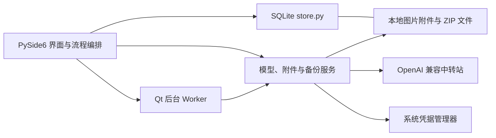

# AI 错题本项目说明

## 项目简介

一款面向学生个人使用的 Windows 桌面错题本。学生可以手动录入题目或导入题目图片，将整理后的题目保存到本地题库，按条件刷题，并记录答题情况与复习进度。AI 用于辅助识别、分类和讲解，所有识别与生成结果均由学生确认后保存。

## 产品目标

- 让收集题目足够快：支持手动录入；图片可从文件选择、剪贴板粘贴或拖放后直接交给 AI 识题。
- 让题目真正可复习：题目进入个人题库后，可以筛选、随机练习和重做错题。
- 让 AI 帮忙但不替学生做决定：识别、分类和解析均可编辑，未经确认不覆盖原题。
- 默认本地管理：题目、图片和答题记录保存在本机；调用云端 AI 时只发送当前任务所需内容。

## 目标用户与边界

第一版服务单个学生，不做教师账号、班级、作业布置、多人共享、云端账号或跨设备同步。导入的练习题、试卷题和错题都可进入同一个个人题库，并通过来源、标签或“错题”标记区分。

## 核心使用流程

1. 学生手动录入题目，或选择/粘贴/拖入图片直接发起 AI 识题。
2. 图片提交给用户选择的视觉模型；识别完成后按题目拆分为可编辑草稿，并显示原图。
3. 学生逐题对照原图检查题干、学科、题型、答案与解析，确认后统一新建题目；原图关联到每道题。
4. 在题库中按学科、题型、错题或掌握情况筛选并开始练习；知识点、标签和来源筛选仍是后续目标。
5. 答题后查看答案和解析，记录对错、用时、错因及掌握程度。
6. 在复习队列中重做到期题目，并查看个人练习记录。

## 第一版技术方向

- Python 3
- PySide6 桌面界面
- SQLite 元数据与练习记录
- 本地附件目录保存原图
- Python 标准库 `urllib.request` 连接模型服务
- Windows 优先，核心逻辑尽量保持跨平台

## 当前功能实现与系统架构

### 功能如何落地

| 功能 | 当前实现 | 关键代码 |
| --- | --- | --- |
| 交互动效 | Qt 原生实现主要页面和内容淡入、主要按钮悬停及按下反馈；快速切换会停止旧淡入，结束后移除效果，不增加依赖。 | `app/ui/motion.py`、`app/ui/main_window.py` |
| 界面组件 | 奶白与浅粉主题，深玫瑰色强调主要操作；统一按钮、输入框、下拉、勾选、标签页、列表和滚动条。题目列表两行区分题干与学科/题型，图片拖入有高亮反馈；图标采用本地 SVG，不增加依赖。 | `app/ui/theme.py`、`assets/ui/`、`checks/check_theme.py` |
| 题库管理 | 首页采用左侧导航、中间列表、右侧详情的布局，列表与详情宽度可拖动调整；选中题目可直接查看题干、答案和解析，编辑及附件操作位于详情区。表单校验后写入 SQLite；列表搜索和筛选由数据库查询完成。 | `app/ui/main_window.py`、`app/database/store.py` |
| 图片识题 | 文件、拖放、剪贴板和自定义快捷键截图均切换到主窗口的识题页面；后台请求所选视觉模型；多题草稿在识题页内切换核对，确认后逐题入库并复制原图。 | `app/ui/main_window.py`、`app/ui/image_recognition_dialog.py`、`app/ui/recognition_draft_dialog.py`、`app/ui/screenshot.py` |
| 模型中转站 | 每个 Profile 单独保存名称、基础地址、请求路径、模型、超时及凭据引用；连接测试和 `GET /models` 在后台线程运行。密钥通过系统凭据管理器保存。 | `app/ui/profiles_dialog.py`、`app/services/model_provider.py`、`app/services/credentials.py` |
| 练习与复习 | 在练习页选择学科与全部题目、仅错题或到期范围，可勾选额外沿用题库的搜索、题型和状态筛选；规则题按归一化文本比较，主观题由用户自评；记录并继续时保存答案、结果、用时、错因和掌握度，并更新到期时间。 | `app/ui/practice_dialog.py`、`app/services/grading.py`、`app/database/store.py` |
| 练习历史 | 查询最近 500 次作答并展示题目、用户答案、判定、掌握度、用时和错因。 | `app/ui/history_dialog.py`、`app/database/store.py` |
| 备份恢复 | ZIP 包含 SQLite 数据库与图片附件；恢复前校验数据库和附件路径，并先备份现有数据。 | `app/services/backup.py` |

### 当前架构

这是一个本地单体桌面应用，没有独立后端。Qt 主窗口使用 `QStackedWidget` 切换题库、识题、题目编辑、练习、练习记录、附件和设置页面；SQLite 模块集中执行数据读写；服务模块处理模型 HTTP、凭据、附件及备份等外部操作。AI 只返回识别草稿，只有用户确认后 UI 流程才调用题库写入，因此网络失败或模型输出不会直接覆盖题库。普通流程状态显示在页面内，文件选择与破坏性操作确认仍使用系统对话框。

截图快捷键通过 Qt `QSettings` 保存，不写入题库数据库。Windows 使用系统全局热键；如果组合键被占用，则回退为应用获得焦点时可用的快捷键。

主要数据流：

1. **识题**：图片输入 → 校验/临时缩放 → 后台模型请求 → 解析结构化题目列表 → 用户逐题核对 → 写入题目和附件。
2. **练习**：筛选题目 → 用户作答 → 揭示答案/规则判分或自评 → “记录并继续”写作答与复习状态 → 历史页查询。
3. **备份**：读取数据库和附件 → 打包 ZIP；恢复时先校验并创建恢复前备份，再替换数据并迁移旧 schema。

`app/database/store.py` 同时承担 SQLite 访问和 schema 版本迁移，目前 schema 为 v5；界面层仍直接调用该模块，尚未拆出独立 repository、domain 或 application-service 层。`app/services/model_provider.py` 是当前唯一模型协议实现，支持 OpenAI Chat Completions 兼容服务，不代表已经支持 Gemini/Grok 原生协议。保持单体和现有模块边界即可；只有出现复杂业务编排或第二种协议时，再拆分相应边界。

## 第一版交付范围

- 题目新增、编辑、删除、列表、搜索与筛选
- 图片导入、原图预览及识别结果编辑确认
- 本地题库刷题、答案解析展示、答题记录
- 错题标记与基础复习队列
- 多个 OpenAI Chat Completions 兼容服务/中转站配置、连通性测试及模型选择；每个配置可单独设置 API 地址、请求路径、密钥和模型
- 数据备份与恢复

## 当前实现状态（2026-10-01）

第一版范围中已有一部分对应代码，实际完成度见下文和《开发手册》。当前程序可手动管理题目、筛选练习、记录复习、直接图片识题、配置 OpenAI 兼容中转站、获取模型列表和备份恢复。图片识题支持拖放、剪贴板粘贴和文件选择；一张图片可返回多道题目的 JSON 草稿，逐题核对后统一收录。

当前筛选字段为学科、题型、错题标记和掌握状态；练习页可直接选择学科与练习范围，只有明确勾选时才沿用题库的搜索、题型和状态限制；练习历史保存用户答案。截图快捷键可在“设置与模型服务”中自定义，默认 `Ctrl+Alt+S`；截图识题不再单独占用侧栏入口。知识点、标签、年级、来源、难度等尚未实现。自动判分使用文本规则，不做主观语义评分。尚未实现 Gemini/Grok 原生接口、云同步和 Windows 安装包。首页及按学科练习已完成临时数据库的离屏检查，尚未完成完整用户验收。

## 暂不纳入

PDF/Word 批量解析、教师协作、云同步、账号系统、移动端、自动组卷、复杂统计分析。可根据第一版使用反馈逐项安排。

## 文档索引

- [开发文档](错题本开发文档.md)：功能需求、架构、数据模型、模型接入约定和验收标准。
- [AI 辅助开发指南](AI辅助开发指南.md)：建议实现顺序、代码边界、开发约束和交付检查清单。
- [开发手册](开发手册.md)：环境准备、目录职责、模块边界和从项目骨架到第一版的开发流程。

